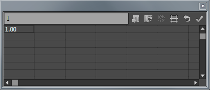
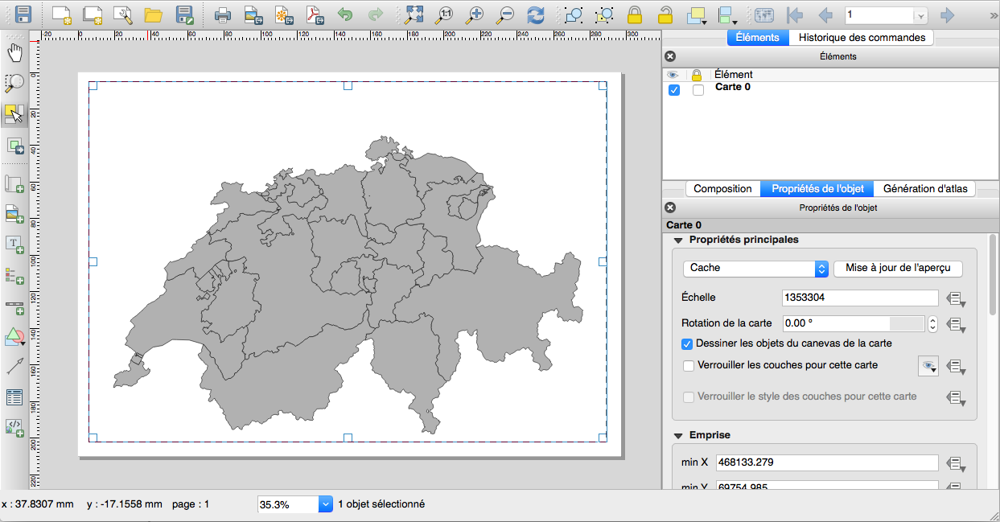
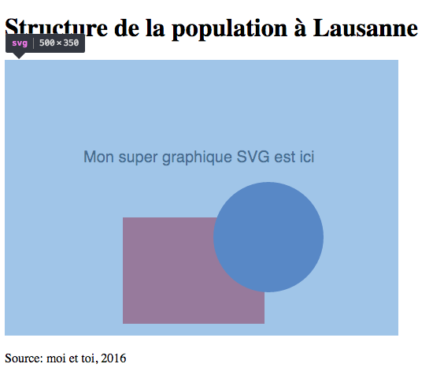

# Atelier 2: Visualisation SVG

*par Lucas Martinez et Christian Kaiser*

---

L'objectif de cet atelier est de:

- créer une visualisation statique avec un logiciel de graphisme (Illustrator ou Inkscape)
- insérer cette visualisation à l'intérieur d'un document HTML pour publication sur le Web

Cet atelier est divisé en 2 parties:

1. Dans un premier temps, nous regardons comment on peut **créer une visualisation dans Illustrator**, avec les possibilités suivantes:

    1. créer un graphique dans Excel, et l'importer dans Illustrator pour finalisation
    2. créer un graphique directement dans Illustrator
    3. créer une carte avec un SIG (p.ex. QGIS ou ArcGIS), avec importation dans Illustrator pour finalisation

2. Et dans un deuxième temps, vous regarderez **comment intégrer un graphique Illustrator dans une page Web**.

---

## 0. Le format SVG

Le SVG (*Scalable Vector Graphics*) est un format de fichier pour dessin vectoriel. Un dessin vectoriel est composé de lignes, formes géométriques (rectangles, cercles, etc.), du texte etc. L'avantage d'un dessin vectoriel est qu'il est possible de l'agrandir sans perte au niveau de la qualité d'affichage, contrairement à une photo par exemple.

D'autres formats de dessin vectoriel sont par exemple le EPS, Postscript (utilisé par des imprimantes professionnels), ou encore le PDF qui en plus peut gérer plusieurs pages. Les dessins vectoriels ont la possibilité d'intégrer des images aussi.

Tandis que les formats EPS, Postscript et PDF proviennent tous de la maison Adobe, SVG est une alternative définie par le World Wide Web Consortium (W3C) comme standard ouvert. Un fichier SVG peut être affiché directement par un navigateur Web, et il est éditable soit avec un logiciel graphique spécialisé ou simplement avec un éditeur de texte. En effet, il s'agit d'un simple fichier texte avec du *code SVG* et extension `.svg`.

Pour le moment, nous ne devons pas comprendre comment créer un fichier SVG avec un éditeur de texte. Nous allons recourir au logiciel de dessin vectoriel professionnel Adobe Illustrator. Plus tard, une fois que nous aurons connaissance du langage HTML, nous comprendrons mieux comment le fichier SVG est construit; en effet, les langages HTML et SVG sont très similaires au niveau de leur structure.

---

## 1. Créer une visualisation dans Illustrator

Le but de cette section est de présenter quelques possibilités comment on peut créer une visualisation dans Illustrator, avec ou sans autre logiciel. Dans tous les cas, Illustrator nous servira de point de départ pour générer un graphique SVG pour le Web.

Il est important à noter que cet atelier n'est bien évidemment pas exhaustif au niveau des possibilités pour créer des graphiques. En effet, il y a d'autres logiciels spécialisés, comme des logiciels statistiques, qui peuvent être utilisés. La plupart de ces logiciels permettent d'exporter leurs visualisations en format PDF ou EPS qui peuvent être lus directement par Illustrator.

On doit également noter qu'Adobe Illustrator n'est pas le seul logiciel qui permet de faire ce travail. Dans certains cas, on peut aussi recourir à Inkscape (https://inkscape.org), une alternative open-source, mais qui n'atteint pas (encore) les mêmes fonctionnalités.

### 1.1 Créer un graphique dans Excel et l'importer dans Illustrator

Microsoft Excel permet de créer facilement des graphiques à partir de séries de données. Cela dit, un logiciel de graphisme tel qu'Illustrator offre de plus grandes possibilités d'édition. Commençons par créer un graphique simple sur Excel (p. ex. un histogramme) à partir d'une série de données quelconque (ancien projet, données inventées). Il y a deux possibilités pour l'importer dans Illustrator

- Sur les dernières versions de Excel, un simple copier-coller suffit:  
Sur la zone de graphique dans Excel, faire un **clic-droit > copier** puis **clic-droit > coller** dans Illustrator
- Si cette méthode ne fonctionne pas, vous pouvez enregistrer le graphique en PDF:  
  Sur la zone de graphique dans Excel, faire un **clic-droit > enregistrer en tant qu'image** puis enregistrer le fichier au format **PDF**. Vous pourrez ensuite ouvrir le fichier directement avec Illustrator, ou importer votre graphique dans un nouveau fichier Adobe Illustrator en allant dans **Fichier > importer**
  
On notera qu'un graphique importé dans Illustrator comporte un certains nombre de masques qui empêchent l'édition du graphique lui-même: il faut *"nettoyer"* le graphique en supprimant tous ces masques en les sélectionnant avec **l'outil de sélection directe** (la flèche blanche) ou depuis la liste des **calques** située généralement dans un onglet à droite de l'écran (on peut afficher la palette des calques depuis le menu **Fenêtre**. Une fois ces masques supprimés, il est possible d'éditer le graphique à votre convenance.

**Une note générale mais importante par rapport aux graphiques Excel**: un bon nombre des graphiques et options proposés par Excel ne sont malheureusement pas très efficaces en termes de communication. Toutes les variantes de graphiques en 3D, ainsi que les camemberts et «graphiques en donut» ne devraient pas être utilisés. La même chose est valable pour les histogrammes à plusieurs rangées. **Utilisez de préférence uniquement les graphiques les plus simples**: histogrammes et barres simples, courbes simples et nuages de points.

### 1.2 Créer un graphique directement dans Illustrator

Il est également possible de créer certains graphiques directement dans Adobe Illustrator. Pour ce faire, il faut ouvrir le menu des outils de graphique (icône avec un petit histogramme dans la barre des outils, généralement sur la gauche de l'écran) au moyen d'un **clic long** puis sélectionner le type de graphique désiré. Pour commencer l'édition graphique, il faut sélectionner sur le plan de travail la zone où l'on souhaite positionner le graphique. Vous devriez voir apparaître un tableau comme celui dans la figure 1.

Il est possible de copier directement les données depuis Excel dans ce menu au moyen d'un **copier-coller**. Une fois le tableau rempli, cliquer sur **appliquer** pour voir le graphique apparaître sur votre pan de travail.

Il est ensuite possible d'éditer le graphique comme vous le souhaitez. Certaines manipulations nécessitent de dissocier le graphique du tableau de données, et Illustrator affichera un message d'alerte correspondant.

### 1.3 Importer une carte SIG dans Illustrator

Les **SIG** permettent de créer des cartes thématiques, mais la finalisation sur un logiciel de graphisme est généralement nécessaire pour obtenir un rendu optimal. Le but est ici d'effectuer cette démarche sur une carte de la densité de population par canton en Suisse. Vous trouverez sur le site Web du cours un dossier **data** (dans [data.zip](data.zip)) contenant une couche vectorielle des cantons suisses `DATA_KTNR.shp`. Effectuez une mise en classe selon l'attribut de densité de population et préparez l'exportation de la carte **PDF**. Pour ce faire vous avez deux possibilités selon le logiciel utilisé:

- Sur ArcGIS:   
   **File > Export Map** puis sélectionner le format **PDF**   
- Sur QGIS:   
  Cliquez sur **Nouveau composeur d'impression** dans la barre d'outils. Dans la nouvelle fenêtre, cliquez sur **Ajouter une nouvelle carte** puis définissez la zone dans laquelle votre carte apparaîtra. Le résultat devrait ressembler à la figure 2.
  

   
Dans les deux cas, ajustez l'emprise de la carte sur la zone d'étude. N'oubliez pas d'ajouter une légende et une échelle par défaut pour retoucher ces éléments par la suite dans Illustrator. Vous pouvez ouvrir la carte sur Illustrator à l'aide d'un simple **clic-droit > Ouvrir avec** puis en sélectionnant **Adobe Illustrator**. Une fois la carte sur Illustrator, il se peut que de nombreux masques soient situés sur votre carte. Supprimez-les comme en utilisant l'outil de sélection directe (la flèche blanche) pour pouvoir éditer la carte comme vous voulez. Ajoutez ou modifiez les différents éléments comme le titre, la légende, l'échelle etc. et mettez la carte au propre.

---

## 2. Intégrer un graphique Illustrator sur une page Web

### 2.1 Exporter le graphique en format SVG

Une fois vos graphiques édités proprement dans Illustrator, ils peuvent être importés dans une page Web afin d'être publiés. Le format **SVG** (pour *Scalable Vector Graphics*) est très répandu dans le cadre des pages Web. Pour exporter un graphique en **SVG** depuis Illustrator, il y a deux possibilités selon les différentes versions:

- **Fichier > Enregistrer sous** puis sélectionner format **SVG** sur les versions *Creative Cloud* installées sur les ordinateurs des salles informatiques.
- **Fichier > Exporter** puis sélectionner format **SVG** sur les versions antérieures.

*Remarque: n'utilisez pas le format SVG compressé.*

Lors de l'enregistrement en format SVG, faites attention d'intégrer les polices de caractères utilisées, ainsi que les images. Par contre, écartez la possibilité d'édition dans Illustrator puisque ça augmenterait considérablement la taille du fichier généré.

### 2.2 Intégrer le fichier SVG dans un page Web

Pour la suite du cours vous aurez besoin d'un **éditeur de texte professionnel**, comme p.ex.

- ***Atom***: https://atom.io, installé notamment sur les ordinateurs à Géopolis
- ***Sublime Text***: http://www.sublimetext.com
- ***TextMate***: http://macromates.com, macOS seulement
- ***Notepad++***: pour Windows seulement

Des éditeurs de texte comme ***Notepad*** ou ***TextEdit*** ne conviennent pas pour un usage professionnel.

Une fois le graphique exporté au format SVG, il s'agit de l'intégrer dans une page Web.

Une page Web est un simple fichier texte avec extension ´.html´ ou ´.htm´ , écrit dans le langage HTML en suivant une structure bien définie. On parle alors d'un fichier HTML. Le HTML n'est pas un langage de programmation, mais un langage de description d'un contenu; par contre on parlera toujours de *code HTML*. Le code HTML permet d'intégrer du contenu externe dans une page Web, comme par exemple une image.

Pour l'intégration d'un graphique SVG, il y deux manières d'intégration dans le code **HTML**:

a. lier le fichier SVG sous forme de référence externe dans le fichier HTML
b. intégrer le code SVG directement à l'intérieur dans le fichier HTML, sans fichier externe

Le premier cas est illustré par le dossier **exemple-svg-reference** disponible sur le site Web du cours ([*exemple-svg-reference.zip*](exemple-svg-reference.zip)). Ce dossier contient deux fichiers:

- Un fichier **SVG** contenant des exemples d'éléments graphiques 
- Un fichier **HTML**, soit une page Web que vous pouvez ouvrir avec votre navigateur. Vous devriez voir apparaître un rectangle rouge, un cercle bleu ainsi qu'un peu de texte.

La figure 3 montre comment la page Web se présente dans le navigateur Web, avec la partie du graphique SVG mis en évidence.

 
Explorez les deux fichiers à l'aide d'un éditeur de texte:  

- Dans le fichier **SVG** vous pouvez observer des éléments tels que `<circle>` ou `<rect>`. Il s'agit de **balises** définissant le type d'objet contenu dans le fichier **SVG**. Des paramètres sont associés à ces balises et définissent les propriétés des éléments graphiques. Par exemple `r="70.5"` représente le rayon du cercle, `width="180" height="135"` les dimensions du rectangle. Les symboles `/>` situés en bout de ligne servent à clôturer ces balises
- Dans le fichier **HTML** vous pouvez voir apparaître la ligne suivante quelque part au milieu du fichier (sur une ligne):  

        <object width="500" height="350" 
              data="graphique-exemple.svg" 
               type="image/svg+xml"></object>

    Il s'agit d'une référence vers le fichier **SVG** permettant à la page Web de charger et d'afficher ce dernier dans un navigateur.

Pour l'instant, vous ne devez pas comprendre le reste du code HTML. Les spécificités du code **HTML** seront présentées dans les ateliers suivants.

La deuxième méthode d'intégration est illustrée par le dossier **exemple-svg-integration** également disponible sur le site Web du cours ([*exemple-svg-integration.zip*](exemple-svg-integration.zip)). Dans ce cas, nous n'avons plus de fichier SVG, mais seulement un fichier HTML. En effet, vous l'avez peut-être constaté, les langages HTML et SVG se ressemblent fortement au niveau de la structure (les deux sont des langages avec des balises du style `<object ...>...</object>` ou encore `<text ...>...</text>`; on y réfère sous le terme de *markup language*).

Si vous regardez le fichier HTML avec le navigateur Web, vous ne devriez pas voir de différence. Par contre, si vous ouvrez le fichier avec votre éditeur de texte, vous allez apercevoir la balise `<svg ...>...</svg>` à l'intérieur du code HTML. Cette balise `svg` est un peu plus simple qu'à l'origine dans le fichier SVG, mais tout ce qui est à l'intérieur de cette balise est identique au fichier SVG. Nous avons pu mélanger du code HTML et du code SVG dans le même fichier HTML!

Essayez maintenant de **remplacer** ces deux exemples par **votre propre graphique** ou **votre propre carte**, en faisant une copie du fichier HTML et en modifiant le code nécessaire. Vérifiez dans votre navigateur Web si le tout s'affiche correctement.

Vous allez vous poser la question laquelle des deux méthodes d'intégration est meilleure. En gros, il n'y a pas de méthode qui est meilleure dans tous les cas. Par contre:

- La méthode de référence permet de garder votre fichier HTML simple et du coup facile à manipuler. Ceci est un avantage surtout dans le cas de graphiques SVG complexes où le code SVG peut devenir complexe et volumineux.
- La méthode de référence permet également d'ouvrir le fichier SVG sans problème dans Illustrator même après intégration dans le fichier HTML. Les éventuels changements seront pris en compte automatiquement. Une édition du contenu SVG inclus dans un fichier HTML n'est pas possible directement.
- Par contre, si on veut interagir avec le contenu SVG, p.ex. depuis un menu déroulant dans le HTML, la méthode avec graphique intégré dans le code HTML est nettement plus simple à mettre en oeuvre. Nous allons apprendre plus tard comment un peut interagir avec le contenu d'un fichier HTML grâce au langage de programmation Javascript.

*Astuce*: si vous avez chargé votre fichier dans le navigateur Web et vous avez modifié le code HTML par la suite (p.ex. vous avez modifié le nom du fichier SVG), il suffit de recharger la page Web dans le navigateur (généralement Ctrl-R, resp. cmd-R sur macOS).

