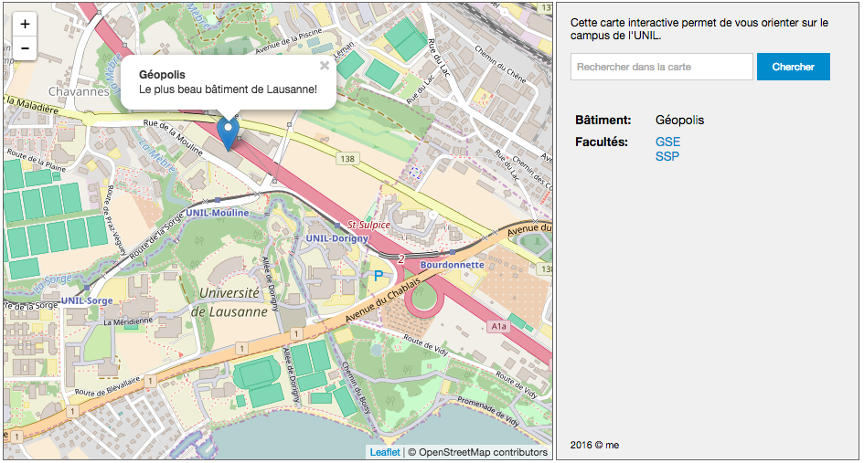
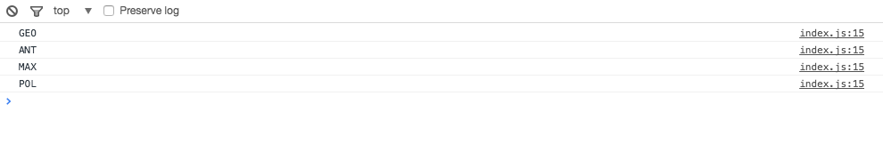
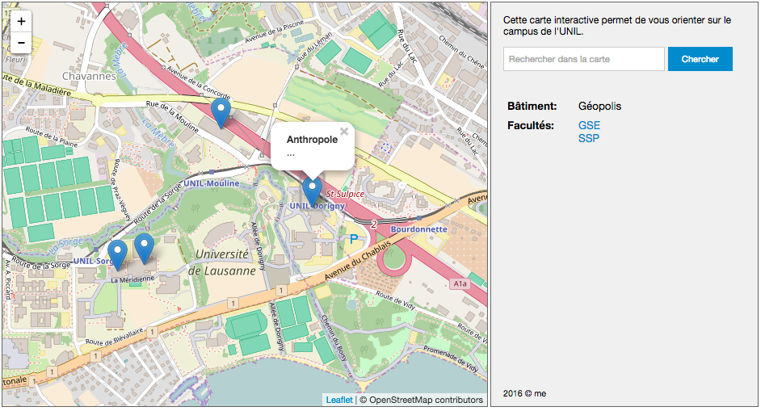

Atelier de géovisualisation 5

## Introduction à Javascript


### 1. But de l'atelier

Dans cet atelier, nous allons faire nos premiers pas en Javascript. Javascript est un langage de programmation qui est utilisé dans les navigateurs Web. Il peut aussi être utilisé pour écrire des logiciels complets, mais ceci dépasse naturellement le cadre d'un cours de géovisualisation. En géovisualisation, Javascript nous permet essentiellement de rajouter l'interactivité que nous désirons avoir au niveau des visualisations.

Nous allons reprendre le résultat de l'atelier 4 et ajouter des points sur la carte pour quelques bâtiments de l'UNIL. Sur le passage, nous allons regarder les concepts Javascript. Le but ne sera donc pas forcément d'obtenir une carte interactive complète, mais de **comprendre les bases du Javascript**.


### 2. Rappel de l'atelier précédent

Le dernier atelier portait sur la compréhension du HTML et surtout du CSS. Cependant, dans notre fichier HTML, nous avions un bout de Javascript à l'intérieur d'une balise `<script>...</script>`:

```html
<html>
  <head>
    ...
  </head>
  <body>
    ...
    <div id="map" class="carte-interactive"></div>
    ...
    <script>
    var mymap = L.map('map').setView([46.524, 6.582], 15);
    var osmLayer = L.tileLayer('http://{s}.tile.osm.org/{z}/{x}/{y}.png', {
    	attribution: '&copy; OpenStreetMap contributors'
  	});
    osmLayer.addTo(mymap);
    </script>
  </body>
</html>
```
Par la suite de cet atelier, nous allons d'abord analyser le code Javascript présent, et puis ajouter petit à petit un peu de nouveau code.


### 3. Inclure du Javascript dans un fichier HTML

Avant de commencer à écrire la première ligne de code Javascript, nous devons savoir comment inclure du code Javascript dans notre fichier HTML. Nous avons 2 possibilités:

1. Écrire le Javascript dans le fichier HTML, à l'intérieur de balises `<script>...</script>`.

2. Écrire le Javascript dans un fichier Javascript (avec extension *.js*, nous parlerons aussi parfois de fichier JS), et insérer une balise dans le fichier HTML pour faire le lien. Supposons que notre fichier Javascript s'appelle *index.js*, nous devons inclure la balise suivante dans notre HTML pour charger le fichier JS:

   ```HTML
   <script src="index.js"></script>
   ```

Théoriquement, nous pouvons placer ces balises `<script>...</script>` un peu partout dans le document HTML. Souvent on les placera à l'intérieur du `<head>...</head>`. Cependant, pour des raisons pratiques, **nous allons placer nos balises `<script>...</script>`** vers la fin du document HTML, **comme dernier élément à l'intérieur du `<body>...</body>`**.

La raison de cela est simple: dans notre code Javascript, nous allons faire référence à des balises HTML qui doivent être chargées par le navigateur avant le code Javascript. Et un navigateur Web charge la page HTML du haut vers le bas.

Quelle méthode choisir? Inclure le Javascript dans le fichier HTML, ou dans un fichier sépararé? Pour des raisons de lisibilité et pour avoir de l'ordre, **nous préférons avoir le code Javascript dans un fichier séparé** (ou même dans plusieurs fichiers Javascript).

Nous allons donc faire ce changement. Dans le fichier ***index.html***, nous remplaçons la balise `<script>...</script>` à la fin du document (sur la ligne avant `</body>` par:

```html
<script src="index.js"></script>
```

Et nous créons un fichier ***index.js* dans le même dossier que le fichier *index.html***, avec le contenu suivant:

```javascript
var mymap = L.map('map').setView([46.524, 6.582], 15);
var osmLayer = L.tileLayer('http://{s}.tile.osm.org/{z}/{x}/{y}.png', {
  attribution: '&copy; OpenStreetMap contributors'
});
osmLayer.addTo(mymap);
```

Rechargez votre fichier HTML pour vous assurer que rien n'est cassé!


### 4. La console Javascript

Les navigateurs Web modernes ont tous une console pour développeurs. Nous allons utiliser la console de Google Chrome. Il y a plusieurs manière de l'ouvrir qui varient en fonction du système d'exploitation. Une des manières qui marche partout est le clic droit sur un élément de la page HTML et puis de sélectionner *«Inspecter»*.

Dans la console de développement, il y a un élément ***«Console»*** qui permet d'**exécuter du code Javascript**, et qui donne **la liste des erreurs** présents dans la page HTML. C'est très pratique pour *vite essayer un bout de code Javascript* et pour trouver les erreurs dans notre code.

Placez le curseur dans la console, et donnez l'instruction `1 + 1`. Ceci devrait renvoyer la réponse `2`, sans grande surprise. `1 + 1` est du code Javascript valable; nous pouvons utiliser la console comme calculatrice.

Essayez le code suivant dans la console:

```javascript
"Hello " + "World"
```

ce qui nous renvoie `"Hello World"`. Une somme entre deux bouts de textes permet de *concaténer deux chaînes de caractères* (*chaîne de caractères* est le terme informatique pour *«bout de texte»*).

Essayez également le code suivant, toujours dans la console:

```javascript
"Nous avons " + 1 + " terre."
```

ce qui nous donne à toute évidence `"Nous avons 1 terre"`. Nous avons donc fait *«la somme»* entre un bout de texte, un nombre, et un autre bout de texte. Javascript a simplement considéré notre nombre comme étant un bout de texte.

Nous avons rencontré ici un premier concept de base en programmation: ***les types***:

- `"Hello World"` est de type *chaîne de caractère* ou ***string***. 
- `1` est de type *nombre entier* ou ***integer***. 
- `1.1` est de type *nombre à virgule flottante* ou ***float*** (c'est grosso modo un nombre avec décimales).

Nous allons rencontrer d'autres types plus loin.

Dans le code Javascript, p.ex. dans ***index.js***, nous pouvons écrire des valeurs dans la console. Insérons par exemple le code suivant sur la dernière ligne du fichier *index.js*:

```javascript
console.log("Hello world.");
```

Rechargeons la page HTML dans le navigateur tout en regardant la console. Si le code s'exécute correctement, nous allons voir *«Hello world.»* apparaître. C'est très pratique pour nous assurer que le code fait effectivement ce que nous voulons!


### 5. Variables

Nous restons pour un moment dans la console de Chrome. Essayons le code suivant:

```javascript
var a = 1;
var b = 2;
a + b;
```

Ceci illustre le concept des ***variables***. Une variable accueille une valeur qui est attribué avec le signe `=`. Par la suite, nous pouvons utiliser la variable à la place de la valeur attribuée.

Le nom d'une variable peut être composée de plusieurs caractères:

```Javascript
var hello = "Hello ";
var world = "World.";
hello + world;
```

Ces deux bouts de code montrent deux autres points importants:

- Nous avons utilisé le ***mot réservé* `var`** avant le nom de la variable. C'est pour dire que le nom qui suit est une **nouvelle variable**. `var` n'est pas strictement nécessaire, mais c'est une bonne pratique qui peut nous éviter des erreurs bizarres plus tard.
- Nous utilisons un **point-virgule** à la fin de chaque ligne. C'est pour indiquer que c'est la fin d'une instruction. En Javascript, il est possible d'écrire plusieurs instructions sur la même ligne, même si ce n'est généralement pas conseillé. Du coup, le point-virgule est nécessaire pour séparer les instructions. Si nous écrivons une instruction par ligne, le point-virgule n'est pas strictement nécessaire, mais une bonne pratique.

Nous sommes maintenant prêts à regarder une première fois notre code de la carte interactive:

```javascript
var mymap = L.map('map').setView([46.524, 6.582], 15);
var osmLayer = L.tileLayer('http://{s}.tile.osm.org/{z}/{x}/{y}.png', {
  attribution: '&copy; OpenStreetMap contributors'
});
osmLayer.addTo(mymap);
```

Quels bouts de code sont les variables?

- sur la ligne 1, `var mymap = ...` définit une nouvelle variable qui contiendra ce qui est à droite.
- sur la ligne 2, nous créons une nouvelle variable `osmLayer`.
- sur la ligne 5, nous utilisons la variable `osmLayer` et la variable `mymap`.

Par ailleurs, nous avons ***3 instructions***:

- une instruction sur la ligne 1
- une instruction sur les lignes 2 à 4 (il n'est pas seulement possible d'écrire plusieurs instructions sur une ligne, mais aussi une instruction sur plusieurs lignes dans certains cas)
- une dernière instruction sur la ligne 5


### 6. Les commentaires

Un code de programmation peut devenir très vite assez compliqué. Pour cette raison, il est très utile de pouvoir écrire des commentaires pour les humains qui lisent le code, pour expliquer ce qui se passe. Dans Javascript, un commentaire peut être écrit avec deux barres obliques au début. Un tel commentaire va jusqu'à la fin de la ligne. Un commentaire ne doit pas forcément commencer au début d'une ligne:

```javascript
// je suis un commentaire
var a = 1;   // ceci définit une variable
```

Il est aussi possible d'écrire des commentaires sur plusieurs lignes, entre `/* ... */`:

```javascript
/* je suis
un commentaire
sur plusieurs lignes
*/
var a = 1;    /* ceci est un commentaire multi-lignes sur une ligne */
```

Écrivez des commentaires là où  vous en avez besoin, tout en gardant en tête que si vous devez relire votre code dans 5 ans, vous aurez à peu près tout oublié et que ce sera grâce aux commentaires que vous allez comprendre ce que vous aviez fait. 

Utilisez aussi des lignes vides pour structurer votre code de manière logique.


### 7. Les fonctions

Une fonction est un ensemble d'instructions avec un but et comportement précis. Cet ensemble d'instructions pourra être utilisé ailleurs dans le code en utilisant simplement le nom de la fonction. Ceci nous permet essentiellement de simplifier le code.

Voici un exemple de définition d'une fonction:

```javascript
function au_carre(n){
  return n*n;
}
```

Le nom de la fonction est alors `au_carre`. Elle prend une valeur en entrée (entre parenthèses, avec nom `n`), et renvoie une autre valeur (la valeur de retour), avec `return`.

Copiez-collez la définition de la fonction ci-dessus dans la console, et puis exécutez la fonction avec:

```javascript
au_carre(2);
```

ce qui nous renvoie le résultat de `n*n`, donc 4.

Les points suivants sont important à noter:

- *appeler la fonction* veut dire exécuter la fonction avec les paramètres passés entre parenthèses. Il peut y avoir plusieurs paramètres.

- dans le code, on reconnaît un appel de fonction grâce aux parenthèses qui suivent juste après le nom de la fonction, sans espace entre deux. Ceci permet de différencier un appel de fonction d'une variable.

- n'utilisez pas les mêmes noms pour les variables et les fonctions, sous peine d'erreurs fréquentes. Le code suivant p.ex. donne une erreur (*"au_carre is not a function"*):

  ```javascript
  function au_carre(n){
    return n*n;
  }
  au_carre = 2;
  au_carre(4);
  ```

  (Techniquement, `function au_carre(n){...}` définit une variable `au_carre` avec type `function`, mais si vous ne savez pas ça, ce n'est pas grave tant que vous respectez la règle ci-dessus).

Regardons la première ligne de notre script de la carte interactive:

```javascript
var mymap = L.map('map').setView([46.524, 6.582], 15);
```

et nous enlevons une partie:

```javascript
var mymap = L.map('map');
```

nous pouvons reconnaître qu'il s'agit d'un appel à la fonction `L.map` (en fait, il s'agit de la fonction `map` à l'intérieur de l'*objet* `L` qui a été créé par la librairie Leaflet, mais nous verrons ça plus loin). Cette fonction `L.map` renvoie un résultat que nous stockons dans la variable `mymap`.

Si nous écrivons notre première ligne de notre script de la façon suivante, nous pouvons voir qu'il y a un deuxième appel à une fonction `setView`:

```javascript
var mymap = L.map('map');
mymap.setView([46.524, 6.582], 15);
```

Ces deux variantes sont strictement équivalents, sauf que l'une est plus compacte que l'autre. Ici, sur la deuxième ligne, nous avons une fonction `setView` qui est contenu dans `mymap`. Regardons dans la section suivante les détails sur comment c'est possible...


### 8. Les dictionnaires

Nous ne parlerons pas de dictionnaires de langue ici. Un dictionnaire est un ***type de variable***, ou une ***structure de données***. Au lieu du nom *dictionnaire*, on utilise aussi les mot ***hash table***, ***key-value pairs*** ou, en Javascript, ***objet***. Tous ces termes réfèrent au même concept.

Voici un exemple d'un dictionnaire:

```javascript
{
  "GEO": "Géopolis",
  "MAX": "Amphimax",
  "ANT": "Anthropole"
}
```

Un dictionnaire est défini entre accolades. Il contient des paires de *«clés»* et de *«valeurs»*. Dans l'exemple ci-dessus, `"GEO"` est la première clé qui correspond à la valeur `"Géopolis"`, puis `"MAX"` la clé de la deuxième paire etc. Les différentes paires sont séparées par des virgules. Il est possible d'écrire le tout sur une ligne, en réduisant la lisibilité:

```javascript
{ "GEO": "Géopolis", "MAX": "Amphimax", "ANT": "Anthropole" }
```

Il n'est pas strictement nécessaire d'écrire les guillemets pour les clés (mais c'est nécessaire pour les valeurs!):

```javascript
{ GEO: "Géopolis", MAX: "Amphimax", ANT: "Anthropole" }
```

Il est possible d'attribuer le dictionnaire à une variable:

```javascript
var batiments = { GEO: "Géopolis", MAX: "Amphimax", ANT: "Anthropole" };
```

On peut alors accéder aux valeurs individuelles en utilisant leur clé. Copiez-coller la ligne ci-dessus dans la console Chrome, et puis essayez le code suivant (les guillemets sont nécessaires ici):

```javascript
batiments["GEO"]
```

ce qui nous renvoie `"Géopolis"`. Ceci est par ailleurs strictement équivalent à:

```javascript
batiments.GEO
```

et on peut aussi attribuer une nouvelle valeur à l'aide de la clé (la clé peut exister ou non):

```javascript
batiments.GEO = "GEOPOLIS";
batiments.POL = "Anthropole";
batiments["INT"] = "Internef";
```

Nous pouvons évidemment aussi stocker d'autres types que des strings dans la valeur d'un dictionnaire, par exemple des nombres, des fonctions, ou d'autres dictionnaires…:

```javascript
batiments.nombre = 5;
batiments.au_carre = function(n) { return n*n; }
batiments["epfl"] = { "GC": "Génie civil", "PH": "Physique" };
```

Pour appeler la fonction `au_carre`, il faut alors écrire:

```javascript
batiments.au_carre(2);
```

Si nous regardons la première ligne de notre script de carte interactive encore une fois (décomposée en deux lignes):

```javascript
var mymap = L.map('map');
mymap.setView([46.524, 6.582], 15);
```

Nous pouvons voir que `L` est un dictionnaire, tout comme la valeur retournée par `L.map(...)` et qui contient une fonction `setView(...)`.

Et si nous regardons la ligne suivante:

```javascript
var osmLayer = L.tileLayer('http://{s}.tile.osm.org/{z}/{x}/{y}.png', {
  attribution: '&copy; OpenStreetMap contributors'
});
```

nous avons un appel à la fonction `L.tileLayer` qui prend deux paramètres, dont le deuxième un dictionnaire. Nous pourrions réécrire cette ligne de la façon suivante:

```javascript
var layerUrl = 'http://{s}.tile.osm.org/{z}/{x}/{y}.png';
var layerOptions = { attribution: '&copy; OpenStreetMap contributors' };
var osmLayer = L.tileLayer(layerUrl, layerOptions);
```

C'est à vous de choisir quelle variante vous préférez…! C'est essentiellement une question d'habitude et de choix entre lisibilité et code plus ou moins court. Nous allons éviter dans tous les cas les lignes trop longues pour éviter de scroller à droite dans la mesure du possible.


### 9. Ajouter les points des bâtiments sur la carte interactive

Il est maintenant temps de rajouter quelques points (des ***marqueurs***, ou *markers* en anglais) sur notre carte interactive.

Nous pouvons créer un nouveau marqueur avec:

```javascript
var geopolis = L.marker([46.52654, 6.57967]);
geopolis.addTo(mymap);
```

ou de manière équivalente:

```javascript
var geopolis = L.marker([46.52654, 6.57967]).addTo(mymap);
```

et pour rajouter une bulle d'info:

```javascript
geopolis.bindPopup("<b>Géopolis</b><br>Le plus beau bâtiment de Lausanne!");
```

(notez le code HTML dans le paramètre).

Insérez ce code dans votre script de carte interactive (dans ***index.js***), et puis vérifiez que vous obtenez le bon résultat:




Pour ajouter plusieurs marqueurs, il est maintenant facile de répéter la même procédure que ci-dessus. C'est possible pour autant que le nombre de marqueurs ne soit pas trop grand!

Mais comme souvent en informatique, il y a une façon *"plus facile"* à faire les choses. Prenons par exemple le code suivant:

```javascript
var batiments = {
  GEO: { nom: "Géopolis", descr: "...", coords: [46.52654, 6.57967] },
  ANT: { nom: "Anthropole", descr: "...", coords: [46.52368, 6.58449] },
  MAX: { nom: "Amphimax", descr: "...", coords: [46.52134, 6.57416] },
  POL: { nom: "Amphipole", descr: "...", coords: [46.52158, 6.57558] }
};
```

Nous y avons toutes les informations nécessaires pour créer l'ensemble des marqueurs!

À la place du code qui crée le marqueur de Géopolis, insérons ce dictionnaire ci-dessus dans notre code Javascript (dans *index.js*), et regardons dans la section suivante sur les boucles comment nous pouvons créer l'ensemble des marqueurs à la fois!


### 10. Les boucles

Une boucle permet d'exécuter le même code plusieurs fois. En fait, on va exécuter le code pour chaque élément d'une collection une fois. Nous pouvons considérer un dictionnaire comme une collection, car nous avons plusieurs paires de clés/valeurs.

En prenant le dictionnaire `batiments` de la section précédente, nous pouvons écrire une boucle avec le code suivant:

```javascript
for (var k in batiments){
  console.log(k);
}
```

Si vous éxécutez ce code dans votre navigateurs, vous devez voir quelque chose comme:



L'instruction `console.log(k);` est donc exécutée 4 fois, une fois pour chaque clé (uniquement les clés de premier niveau sont prises en compte). La variable `k` contient à chaque fois la clé respective.

Nous pouvons donc ajouter les 4 marqueurs en écrivant le code adapté dans la boucle (avec commentaires):

```javascript
for (var k in batiments){
  // Obtenir le bâtiment actuellement traité:
  var bati = batiments[k];
  
  // Créer le marqueur pour le bâtiment et l'ajouter à la carte:
  var marqueur = L.marker(bati.coords).addTo(mymap);
  
  // Et créer la bulle d'info et l'associer au marqueur:
  marqueur.bindPopup("<b>"+bati.nom+"</b><br>"+bati.descr);
}
```

ce qui doit vous donner le résultat suivant:



Voici le code complet du fichier *index.js*:

```javascript
var mymap = L.map('map').setView([46.524, 6.582], 15);
var osmLayer = L.tileLayer('http://{s}.tile.osm.org/{z}/{x}/{y}.png', {
  attribution: '&copy; OpenStreetMap contributors'
});
osmLayer.addTo(mymap);

var batiments = {
  GEO: { nom: "Géopolis", descr: "...", coords: [46.52654, 6.57967] },
  ANT: { nom: "Anthropole", descr: "...", coords: [46.52368, 6.58449] },
  MAX: { nom: "Amphimax", descr: "...", coords: [46.52134, 6.57416] },
  POL: { nom: "Amphipole", descr: "...", coords: [46.52158, 6.57558] }
};

for (var k in batiments){
  var bati = batiments[k];
  var marqueur = L.marker(bati.coords).addTo(mymap);
  marqueur.bindPopup("<b>"+bati.nom+"</b><br>"+bati.descr);
}
```

Essayez de comprendre ce qui se passe dans la boucle… Qu'est-ce que le code `batiments[k]` fait? Qu'est-ce qui se passe dans le bout `"<b>"+bati.nom+"</b><br>"+bati.descr`, qui est le paramètre à `marqeur.bindPopup`?

Ajoutez une description à chaque bâtiment, et par la suite formattez le dictionnaire `batiments` sur plusieurs lignes par bâtiment, pour maximiser la lisibilité. Utilisez l'indentation pour vous retrouvez dans le code!