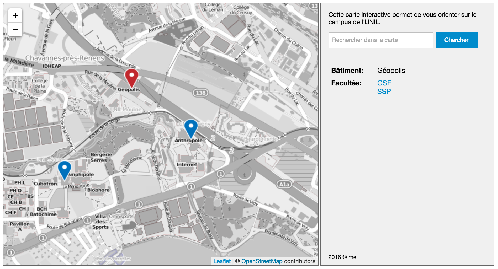
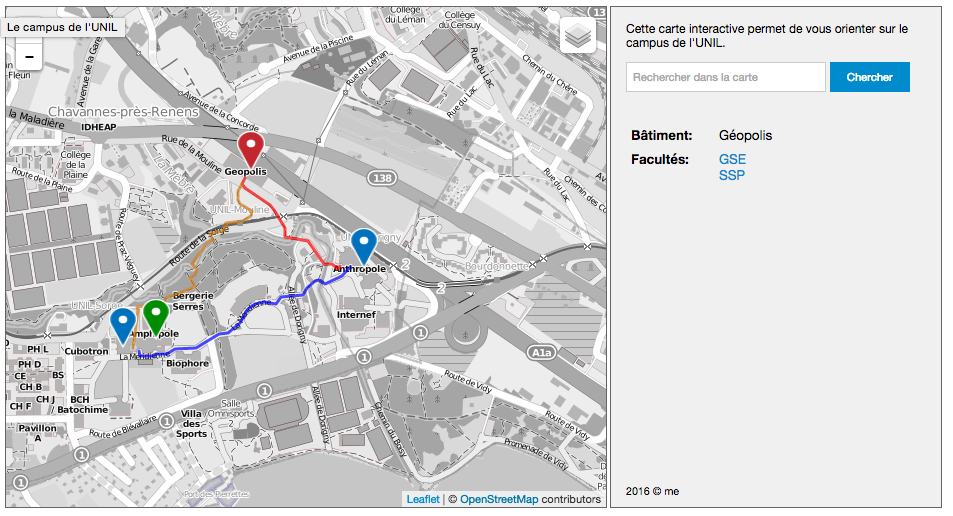

Atelier de géovisualisation 6

## Leaflet 2


*Remarques:*

- *Le résultat des ateliers précédents est disponible pour téléchargement sur Github. Il peut servir de point de départ pour cet atelier.*


### 1. But de l'atelier

Dans cet atelier, nous allons continuer notre carte Leaflet que nous avons commencé dans les ateliers précédents. Nous allons y ajouter les fonctionnalités suivantes:

- possibilité de sélectionner la couche de fond
- restreindre l'étendu de la carte
- modifier l'icône d'un marqueur
- ajouter une couche de lignes ou de polygones


### 2. Rappel de l'atelier précédent

Dans l'atelier précédent, nous avons regarder le code Javascript de près, et nous avons ajouté un marqueur par bâtiment de l'UNIL, à l'aide d'une boucle `for`.

Voici notre code Javascript complet jusqu'à maintenant:

```javascript
var mymap = L.map('map').setView([46.524, 6.582], 15);
var osmLayer = L.tileLayer('http://{s}.tile.osm.org/{z}/{x}/{y}.png', {
  attribution: '&copy; OpenStreetMap contributors'
});
osmLayer.addTo(mymap);

var batiments = {
  GEO: { nom: "Géopolis", descr: "...", coords: [46.52654, 6.57967] },
  ANT: { nom: "Anthropole", descr: "...", coords: [46.52368, 6.58449] },
  MAX: { nom: "Amphimax", descr: "...", coords: [46.52134, 6.57416] },
  POL: { nom: "Amphipole", descr: "...", coords: [46.52158, 6.57558] }
};

for (var k in batiments){
  var bati = batiments[k];
  var marqueur = L.marker(bati.coords).addTo(mymap);
  marqueur.bindPopup("<b>"+bati.nom+"</b><br>"+bati.descr);
}
```

Le code complet de l'atelier précédent est disponible ici: https://github.com/christiankaiser/ateliers-leaflet/releases/tag/v3.0


### 3. Changer le fond de carte

La couche de base de notre carte interactive provient actuellement d'OpenStreetMap (OSM). Nous définissons ce fond de carte avec l'instruction

```javascript
var osmLayer = L.tileLayer('http://{s}.tile.osm.org/{z}/{x}/{y}.png', {
  attribution: '&copy; OpenStreetMap contributors'
});
```

où nous avons ajouté l'URL des tuiles OSM, comme défini par OpenStreetMap.

On parle de **tuiles XYZ**, et plusieurs couches sont disponibles en lignes, prêtes à être utilisées. En voici quelques-uns:

- **OpenStreetMap**
  URL: `http://{s}.tile.osm.org/{z}/{x}/{y}.png`
  Attribution: `&copy; <a href="http://openstreetmap.org">OpenStreetMap</a> contributors`
- **OpenStreetMap**, version noir/blanc
  URL: `http://{s}.www.toolserver.org/tiles/bw-mapnik/{z}/{x}/{y}.png`
  Attribution: `&copy; <a href="http://openstreetmap.org">OpenStreetMap</a> contributors`
- **Images satellites ESRI**
  URL: `http://server.arcgisonline.com/ArcGIS/rest/services/World_Imagery/MapServer/t\ile/{z}/{y}/{x}`
  Attribution: `&copy; <a href="http://www.esri.com">Esri</a>, i-cubed, USDA, USGS, AEX, GeoEye, Getmapping, Aerogrid, IGN, IGP, UPR-EGP, and the GIS User Community`
- **Mapbox**
  Mapbox fournit un service qui permet d'utiliser des tuiles de styles différents, et en plus il est possible de personnaliser les fonds de cartes. Ce service est gratuit dans certaines limites, et nous allons regarder ce service de plus près dans un atelier ultérieur, notamment pour créer nos propres fonds de cartes. Pour l'instant, voici un exemple:
  URL: `https://api.mapbox.com/styles/v1/mapbox/streets-v10/tiles/256/{z}/{x}/{y}?access_token=pk.eyJ1IjoiY2thaXNlciIsImEiOiJaS2cxcmVzIn0.IVsFCwYP0dpDlCdpsAGEcQ`
  Attribution: `&copy; <a href="https://www.mapbox.com/about/maps/">Mapbox</a> &copy; <a href="http://www.openstreetmap.org">OpenStreetMap</a> contributors`

Nous allons maintenant intégrer les 4 fonds de cartes dans notre carte interactive, avec la possibilité de choisir le fond à afficher. Vous trouvez les instructions également dans une partie du tutoriel «Layer Groups and Layers Controls» sur le site de Leaflet (http://leafletjs.com/examples/layers-control/).

Dans une première étape, nous répétons l'instruction pour créer une couche de base pour chacune des 4 variantes:

```javascript
var osmLayer = L.tileLayer('http://{s}.tile.osm.org/{z}/{x}/{y}.png', {
  attribution: '&copy; <a href="http://openstreetmap.org">OpenStreetMap</a> contributors'
});
var osmNoirBlanc = L.tileLayer(
  'http://{s}.www.toolserver.org/tiles/bw-mapnik/{z}/{x}/{y}.png', { 
    attribution: '&copy; <a href="http://openstreetmap.org">OpenStreetMap</a> contributors'
  }
);
var mapboxStreets = L.tileLayer(
  'https://api.mapbox.com/styles/v1/mapbox/streets-v10/tiles/256/{z}/{x}/{y}?access_token=pk.eyJ1IjoiY2thaXNlciIsImEiOiJaS2cxcmVzIn0.IVsFCwYP0dpDlCdpsAGEcQ', {
    attribution: '&copy; <a href="https://www.mapbox.com/about/maps/">Mapbox</a> &copy; <a href="http://www.openstreetmap.org">OpenStreetMap</a> contributors'
  }
);
var esriImagery = L.tileLayer(
  'http://server.arcgisonline.com/ArcGIS/rest/services/World_Imagery/MapServer/t\ile/{z}/{y}/{x}', {
    attribution: '&copy; <a href="http://www.esri.com">Esri</a>, i-cubed, USDA, USGS, AEX, GeoEye, Getmapping, Aerogrid, IGN, IGP, UPR-EGP, and the GIS User Community'
  }
);
```

Ceci ne change rien sur notre carte. Pour cela, nous devons créer les boutons sur la carte interactive pour pouvoir choisir la couche. Leaflet fournit un «contrôleur de couche» pour cela (documenté ici: http://leafletjs.com/reference-1.0.0.html#control-layers), nous pouvons simplement l'utiliser pour notre carte:

```javascript
var baseLayers = {
  "OpenStreetMap": osmLayer,
  "OpenStreetMap noir/blanc": osmNoirBlanc,
  "Mapbox Streets": mapboxStreets,
  "Photos aériennes ESRI": esriImagery
};
var overlays = {};
L.control.layers(baseLayers, overlays).addTo(mymap);
```

Notez que la couche initiale au moment du chargement n'a pas changée. La couche initiale est définie avec l'instruction

```javascript
osmLayer.addTo(mymap);
```

Si vous voulez afficher par exemple la carte noir/blanche à la place, il faudrait remplacer cette ligne par:

```javascript
osmNoirBlanc.addTo(mymap);
```

---

#### Choix du fond de carte

Essayez de comparer quel fond de carte vous jugez le mieux adapté parmi les 4, en vue de montrer les bâtiments de l'UNIL:

- Comment le fond de carte affecte-t-il la perception des marqueurs des bâtiments? 
- Qu'en-est-il des bâtiments eux-mêmes?
- Et pour trouver le chemin pour aller d'un bâtiment à un autre, quel fond de carte choisissez-vous?
- Est-ce que vous pouvez faire des propositions d'amélioration du fond de carte?

Ces questions sont centrales en géovisualisation. Le choix du fond de carte doit être fait avec beaucoup de soin afin de garantir la meilleure carte possible.

Dans un atelier ultérieur, nous allons adapter notre fond de carte pour mieux correspondre à nos besoins.

---


### 4. Restreindre l'étendu de la carte

Pour une carte interactive du campus de l'UNIL, nous n'avons pas besoin de consulter la carte de la planète entière. Il est une bonne pratique de limiter l'étendu de la carte à la région à montrer. Ceci peut être défini avec l'instruction Leaflet `setMaxBounds`. Voici l'instruction qui permet de restreindre notre carte sur le campus de l'UNIL (toutes les coordonnées sont en lat/long):

```javascript
mymap.setMaxBounds([[46.511, 6.554], [46.541, 6.606]]);
```

Une fois le changement fait, essayez de vous déplacer en dehors du campus. La carte rebondira automatiquement pour revenir sur le campus! Par contre, ceci ne limite pas les niveaux de zoom. Ainsi, il est toujours possible d'afficher le monde entier... Pour régler cela, nous pouvons définir un niveau de zoom minimal, p.ex.

```javascript
mymap.setMinZoom(14);
```

*Astuce:* si vous voulez connaître le niveau de zoom actuel de votre carte interactive, vous pouvez simplement l'afficher dans Chrome, ouvrir la console Javascript et taper `mymap.getZoom()`.

---

#### Complément Javascript: les listes

Dans l'exemple ci-dessus nous avons indiqué l'étendu géographique de la carte de la façon suivante:

```javascript
[[46.511, 6.554], [46.541, 6.606]]
```

Il s'agit ici d'une autre structure de données Javascript que nous n'avons pas encore vu: **les listes**, aussi appelé **arrays** en anglais. Il s'agit tout simplement d'une collection ordonnée d'éléments. Voici une liste simple:

```javascript
[1, 2, 3]
```

 Nous pouvons attribué la liste à une variable:

```javascript
var a = [1, 2, 3];
```

et puis référer à chaque élément séparément. Ainsi `a[0]` est le premier élément de la liste, `a[1]` le deuxième etc. `a.length` nous donne le nombre d'éléments dans la liste.

Nous pouvons insérer n'importe quel type d'éléments dans une liste, comme par exemple des nombre, du texte, des objets ou d'autres listes:

```javascript
var b = [1, "abc", {"nom": "Albert"}, [4,5,6]];
```

Ainsi, l'étendu géographique ci-dessus est une liste qui contient deux éléments, qui à leurs tour sont des listes avec deux éléments:

```javascript
[[46.511, 6.554], [46.541, 6.606]]
```

Dans Leaflet, nous pouvons indiquer toute étendu géographique de cette manière, où les valeurs individuelles correspondent à

```
[[<latitude minimale>, <longitude minimale>], [<latitude maximale>, <longitude maximale>]]
```

dsafd

---


### 5. Modifier l'icône d'un marqueur

Il est assez fréquent de vouloir personnaliser l'icône d'un marqueur, au lieu du marqueur par défaut. Ceci n'est pas très compliqué, mais nécessite une ou deux images PNG: une image avec le marqueur, et éventuellement une autre avec l'ombre du marqueur.

Vous trouvez quelques exemples de marqueurs, avec fichier Illustrator permettant de les modifier, sur [https://github.com/christiankaiser/map-marker-icons](https://github.com/christiankaiser/map-marker-icons).

Par ailleurs, sur le site Leaflet, vous trouvez un tutoriel qui explique la création d'une icône personnalisée: [http://leafletjs.com/examples/custom-icons/](http://leafletjs.com/examples/custom-icons/)

Afficher un marqueur avec une icône personnalisée, nous procédons en deux étapes:

1. nous créons une icône
2. nous créons le marqueur en indiquant d'utiliser notre icône.

Pour créer une icône, nous pouvons utiliser l'instruction Leaflet `L.icon`, voici un exemple pour un marqueur rouge:

```javascript
var iconeMarqueurRouge = L.icon({
    iconUrl: 'https://github.com/christiankaiser/map-marker-icons/raw/master/icons/plain-red.png',
    iconSize: [28, 41],
    iconAnchor:   [14, 40],
    popupAnchor:  [0, -40]
 });
```

Si vous avez créé une icône PNG sur votre disque dur, vous pouvez la placer dans un dossier `icones` dans le dossier où se trouve votre fichier `index.html`, et puis remplacer l'URL de l'icône:

```javascript
var iconeMarqueurRouge = L.icon({
    iconUrl: 'icones/plain-red.png',
    iconSize: [28, 41],
    iconAnchor:   [14, 40],
    popupAnchor:  [0, -40]
 });
```

Vous devez également adapter la taille de l'icône avec `iconSize: [<largeur>, <hauteur>]`.

Il faut également indiquer quel pixel de votre image correspond à la coordonnée du marqueur. On parle ici du point d'ancrage de l'icône qui peut être modifié avec `iconAnchor: [<x>, <y>]`.

L'option `popupAnchor: [<x>, <y>]` finalement définit où l'info-bulle s'ouvre par rapport à l'icône. Essayez plusieurs variantes pour trouver ce qui va le mieux...

Puis dans une deuxième étape, vous créez le marqueur en indiquant votre icône. À la place de la ligne

```javascript
var marqueur = L.marker(bati.coords).addTo(mymap);
```

vous écrivez simplement

```javascript
var marqueur = L.marker(bati.coords, {icon: iconeMarqueurRouge}).addTo(mymap);
```


#### 5.1 Varier l'icône d'un marqueur à l'autre

On peut bien sûr faire varier l'icône du marqueur. Pour cela, nous devons d'abord créer tous les marqueurs, et les stocker par exemple à l'intérieur d'un dictionnaire (objet). Voici un exemple:

```javascript
var icones = {};

icones['rouge'] = L.icon({
  iconUrl: 'https://github.com/christiankaiser/map-marker-icons/raw/master/icons/plain-red.png',
  iconSize: [28, 41],
  iconAnchor:   [14, 40],
  popupAnchor:  [0, -40]
});

icones['bleu'] = L.icon({
  iconUrl: 'https://github.com/christiankaiser/map-marker-icons/raw/master/icons/plain-blue.png',
  iconSize: [28, 41],
  iconAnchor:   [14, 40],
  popupAnchor:  [0, -40]
});
```

Nous devons encore savoir quelle icône on veut utiliser pour quel marqueur. Cette information peut aller dans notre tableau de données sur les bâtiments (nous avons volontairement «oublié» de saisir la valeur pour l'Amphipole):

```javascript
var batiments = {
  GEO: { nom: "Géopolis", icone: "rouge", descr: "...", coords: [46.52654, 6.57967] },
  ANT: { nom: "Anthropole", icone: "bleu", descr: "...", coords: [46.52368, 6.58449] },
  MAX: { nom: "Amphimax", icone: "bleu", descr: "...", coords: [46.52134, 6.57416] },
  POL: { nom: "Amphipole", icone: "", descr: "...", coords: [46.52158, 6.57558] }
};
```

Et puis nous pouvons créer les marqueurs en fonction de cette nouvelle propriété `icone` (seul la ligne 3 a changé):

```javascript
for (var k in batiments){
  var bati = batiments[k];
  var marqueur = L.marker(bati.coords, {icon: icones[bati.icone]}).addTo(mymap);
  marqueur.bindPopup("<b>"+bati.nom+"</b><br>"+bati.descr);
}
```

Le résultat devrait être quelque chose comme ça (notez l'absence du marqueur pour l'Amphipole, et si vous faites tourner le code dans le navigateur, il y aura également une erreur dans la console):




Il est une bonne pratique ici de vérifier si la valeur de la propriété `icone` des bâtiments est soit `rouge` soit `bleu`, afin de nous assurer qu'il y a toujours un marqueur affiché sur la carte. En effet, un petit oubli ou une petite erreur dans les données pourrait alors entraîner la disparition d'un marqueur, et même pire, faire que notre code Javascript et donc notre carte interactive ne tourne plus correctement. De telles vérifications sont donc essentielles au bon fonctionnement de notre carte interactive!

Nous aimerions écrire une vérificaton qui pourrait être formulée en français comme:

> Si la valeur de la propriété `icone` est soit `bleu` soit `rouge`, nous créons un marqueur correspondant, et sinon,  nous créons un marqueur vert.

Tout d'abord nous ajoutons une icône verte à notre dictionnaire `icones`:

```javascript
icones['vert'] = L.icon({
  iconUrl: 'https://github.com/christiankaiser/map-marker-icons/raw/master/icons/plain-green.png',
  iconSize: [28, 41],
  iconAnchor:   [14, 40],
  popupAnchor:  [0, -40]
});
```

Notre vérification formulé en haut est en fait **une condition**, qui est un autre concept important en programmation. La condition permet d'exécuter un bout de code uniquement sous certaines circonstances.

La structure de base d'une condition est la suivante:

```javascript
if (<condition>) {
  /* code exécuté uniquement si la condition est remplie */
} else {
  /* code exécuté uniquement si la condition n'est pas remplie */
}
```

La deuxième partie `else { ... }` est optionnelle.

Pour les conditions, il y a plusieurs *opérateurs logiques* pour comparer deux valeurs:

`==` est l'opérateur d'égalité. Par exemple `bati.icone == "rouge"` pour tester si la valeur de la propriété `icone` est `rouge`. Vous pouvez tester le code suivant dans la console Javascript de Chrome:

```javascript
a = 12
a == 12
```

La première ligne attribue la valeur 12 à la variable `a` (avec un seul signe `=`). La deuxième ligne compare la valeur de la variable `a` avec la valeur 12, il s'agit donc d'une comparaison, qui dans notre cas renvoie `true` (donc une condition qui est remplie).

D'autres *opérateurs logiques* sont:

- `>`: plus grand que
- `<`:  plus petit que
- `>=`: plus grand ou égal
- `<=`: plus petit ou égal
- `!=`: pas égal

Nous pourrions donc écrire le code suivant:

```javascript
if (bati.icone == 'rouge') {
  var iconeMarqueur = icones[bati.icone];
} else {
  var iconeMarqueur = icones['vert'];
}
var marqueur = L.marker(bati.coords, {icon: iconeMarqueur}).addTo(mymap);
```

ce qui fait un marqueur rouge pour Géopolis et un marqueur vert pour tous les autres.

Nous devons encore intégrer l'icône bleue dans notre condition. Cela peut être faite avec les **enchaînement logiques de conditions**: si `icone` est rouge **OU** `icone` est bleue. L'opérateur **OU** est écrit avec `||` (deux barres verticales), tandis que l'opérateur **ET** est écrit avec `&&`. Nous devons donc modifier notre code comme suit (seul la ligne 1 change):

```javascript
if (bati.icone == 'rouge' || bati.icone == 'bleu') {
  var iconeMarqueur = icones[bati.icone];
} else {
  var iconeMarqueur = icones['vert'];
}
var marqueur = L.marker(bati.coords, {icon: iconeMarqueur}).addTo(mymap);
```

ce qui est par ailleurs la même chose que:

```javascript
var iconeMarqueur = icones['vert'];
if (bati.icone == 'rouge' || bati.icone == 'bleu') {
  iconeMarqueur = icones[bati.icone];
}
var marqueur = L.marker(bati.coords, {icon: iconeMarqueur}).addTo(mymap);
```

Voici le code complet concernant les marqueurs:

```javascript
var icones = {};

icones['rouge'] = L.icon({
  iconUrl: 'https://github.com/christiankaiser/map-marker-icons/raw/master/icons/plain-red.png',
  iconSize: [28, 41],
  iconAnchor:   [14, 40],
  popupAnchor:  [0, -40]
});

icones['bleu'] = L.icon({
  iconUrl: 'https://github.com/christiankaiser/map-marker-icons/raw/master/icons/plain-blue.png',
  iconSize: [28, 41],
  iconAnchor:   [14, 40],
  popupAnchor:  [0, -40]
});

icones['vert'] = L.icon({
  iconUrl: 'https://github.com/christiankaiser/map-marker-icons/raw/master/icons/plain-green.png',
  iconSize: [28, 41],
  iconAnchor:   [14, 40],
  popupAnchor:  [0, -40]
});

var batiments = {
  GEO: { nom: "Géopolis", icone: "rouge", descr: "...", coords: [46.52654, 6.57967] },
  ANT: { nom: "Anthropole", icone: "bleu", descr: "...", coords: [46.52368, 6.58449] },
  MAX: { nom: "Amphimax", icone: "bleu", descr: "...", coords: [46.52134, 6.57416] },
  POL: { nom: "Amphipole", icone: "", descr: "...", coords: [46.52158, 6.57558] }
};

for (var k in batiments){
  var bati = batiments[k];
  var iconeMarqueur = icones['vert'];
  if (bati.icone == 'rouge' || bati.icone == 'bleu') {
    iconeMarqueur = icones[bati.icone];
  }
  var marqueur = L.marker(bati.coords, {icon: iconeMarqueur}).addTo(mymap);
  marqueur.bindPopup("<b>"+bati.nom+"</b><br>"+bati.descr);
}
```


### 6. Ajouter une couche de lignes ou de polygones

Il est fréquent que nous devons afficher d'autres éléments que juste des marqueurs sur une carte. Nous pouvons afficher des lignes et polygones dans une carte interactive à l'aide du **format GeoJSON**. Un fichier GeoJSON est équivalent à un fichier ESRI Shape que nous connaissons des SIG, mais il a l'avantage qu'il est facile à utiliser avec Javascript. En effet, il ne s'agit de rien d'autre que d'un *objet Javascript* (JSON = *JavaScript Object Notation*).

De manière pratique, nous créons d'abord un fichier Shape avec notre logiciel SIG préféré (attention de définir correctement le système de référence spatiale). Par la suite, nous pouvons simplement exporter notre fichier Shape en format GeoJSON avec QuantumGIS:

1. Menu Couche > Enregistrer sous…
2. Dans le dialogue suivant, choisir «GeoJSON» dans le menu «Format»
3. Dans le menu «SCR» choisir WGS84 (EPSG:4326)
4. À droite du champ «Enregistrer sous…» cliquer sur «Parcourir» et définir le lieu de destination du nouveau fichier
5. Laisser le reste sur les valeurs par défaut et cliquer sur «OK»

Pour intégrer le fichier JSON dans notre carte interactive, nous procédons de la manière suivante:

1. Déplacer le fichier GeoJSON (dans notre exemple nommé `chemins-unil.geojson`) dans le même dossier que les fichiers `index.html` et `index.js`

2. Changer l'extension du fichier en `.js`, donc `chemins-unil.js` dans notre exemple.

3. Ouvrir le fichier `chemins-unil.js` avec l'éditeur de texte et ajouter le nom de la variable dans laquelle nous voulons enregistrer notre couche GeoJSON, donc par exemple (nous avons enlevé une bonne partie du fichier pour des raisons de lisibilité):

   ```javascript
   var cheminsUnil = {
   	"type": "FeatureCollection",
   	"crs": { "type": "name", "properties": { "name": "urn:ogc:def:crs:OGC:1.3:CRS84" } },                                                                             
   	"features": [ ... ]
   };
   ```

   dsf

4. Inclure le fichier `chemins-unil.js` dans notre fichier `index.html`, en ajoutant la balise `script` correspondante dans le `head` du document HTML (p.ex. juste avant la balise de fermeture `</html>`:

   ```html
   <script src="chemins-unil.js"></script>
   ```

Et puis dans notre fichier **index.js**, nous pouvons simplement ajouter le contenu de ce fichier à l'aide de la fonction `geoJSON` de Leaflet:

```javascript
L.geoJSON(cheminsUnil).addTo(mymap);
```

Nous pouvons également définir un style pour notre couche, sous forme de dictionnaire que nous donnons comme attribut à la fonction `L.geoJSON`:

```javascript
var cheminsUnilStyle = {
  "color": "#ff0000",
  "weight": 3,
  "opacity": 0.7
};
L.geoJSON(cheminsUnil, cheminsUnilStyle).addTo(mymap);
```

Il est également possible d'ajouter chaque géométrie séparément, et ainsi varier le style entre les différents éléments, par exemple en utilisant la valeur d'un attribut du fichier Shape (ici l'attribut `color`):

```javascript
for (var i in cheminsUnil.features) {
  var feature = cheminsUnilStyle.features[i];
  var cheminStyle = {
    "color": feature.properties.color,
  	"weight": 3,
  	"opacity": 0.7
  };
  L.geoJSON(feature, cheminStyle).addTo(mymap);
}
```

Ainsi il est relativement aisé de faire des cartes interactives avec un sémiologie logique et riche. Par contre, il est encore plus facile de créer des cartes difficiles à lire! Soyez donc très attentifs à la lisibilité, la logique et la sémiologie. Le choix du fond de carte correspondant est crucial aussi.

Sur le site Web de Leaflet, il y a un tutoriel qui explique comment ajouter des couches GeoJSON: http://leafletjs.com/examples/geojson/

Vous trouvez d'autres tutoriels Leaflet sur http://leafletjs.com/examples.html, par exemple pour créer une carte choroplèthe interactive: http://leafletjs.com/examples/choropleth/

Voici le résultat final de cet atelier:



Le code complet est disponible ici: [https://github.com/christiankaiser/ateliers-leaflet/releases/tag/v4.0.1](https://github.com/christiankaiser/ateliers-leaflet/releases/tag/v4.0.1)

Le code est également inclut dans le répertoire complet du cours sur [https://github.com/christiankaiser/geovis1](https://github.com/christiankaiser/geovis1).

