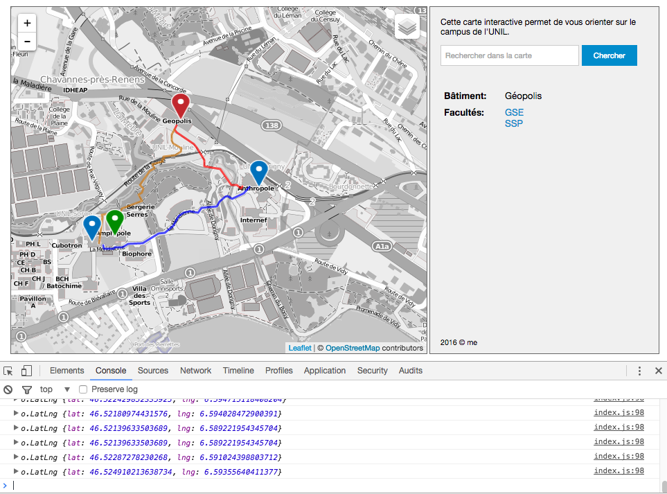

Atelier de géovisualisation 7

## Leaflet 3


### 1. But de l'atelier

Basé sur l'atelier de la semaine passée, nous allons regarder comment introduire un peu d'interactivité, à travers des événements Javascript. Un tel événement peut être un clic sur un marqueur, le changement du choix dans un menu déroulant, ou tout autre chose.

Concrètement, nous allons ajouter les fonctionnalités suivantes à notre carte interactive:

- une indication sur les coordonnées de la souris lorsque le pointeur se trouve sur la carte
- remplacer les infos-bulles par des informations à côté de la carte, disponibles lorsqu'on passe par dessus le marqueur ou on clique dessus
- centrer la carte sur le marqueur du bâtiment lorsqu'on choisit le bâtiment dans un menu déroulant


### 2. Rappel de l'atelier précédent

Dans l'atelier précédent, nous avons approfondi considérablement notre code Javascript en ajoutant les fonctionnalités suivantes:

- plusieurs couches de fond avec possibilité de sélection
- restreindre l'étendu de la carte
- icônes personnalisés pour les marqueurs
- ajouter des couches GeoJSON

Le code complet de l'atelier précédent est disponible ici: https://github.com/christiankaiser/ateliers-leaflet/releases/tag/v4.0.1


### 3. Indiquer les coordonnées de la souris

Il est généralement une bonne pratique d'afficher les coordonnées actuelles de la souris sur la carte, quelque part en petit à côté de la carte. C'est illustré par exemple sur les cartes interactives de Swisstopo (https://map.geo.admin.ch).

Pour pouvoir réaliser ce petit changement, nous devons introduire les ***événements Javascript***. En effet, à chaque petite action qu'un utilisateur fait dans un navigateur, il y a un ou plusieurs événements Javascript qui sont déclenchés. Des exemples de tels événements sont:

- un clic quelque part
- un mouvement de la souris
- lorsque la souris entre ou sort d'un élément sur la page (pour chaque balise visible sur la page!)
- appuyer sur une touche du clavier, ainsi que relâcher la touche
- redimensionner la fenêtre du navigateur

En plus, des librairies comme Leaflet définissent d'autres événements. Dans le cas de Leaflet, il y a entre autres les événements suivants:

- déplacer la carte (pan)
- faire un zoom sur la carte
- cliquer sur un marqueur
- fermer une info-bulle
- …

Tous les événements fonctionnent de la même manière:

1. On annonce qu'on veut être notifié si un événement précis se produit.
2. On définit une fonction qui sera exécutée lorsque cet événement se produit, ce qui nous permet d'exécuter une action suite à une interaction de l'utilisateur.

Pour annoncer qu'on est intéressé par un événement (on dit qu'on *«s'enregistre pour un événement»*), on doit connaître l'objet qui *lance l'événement*, ce qui est généralement l'élément sur la page où l'action se produit. Ce qui nous intéresse pour le moment, c'est le mouvement de la souris sur la carte. En l'occurrence, l'événement qui nous intéresse est le **mousemove** de la carte Leaflet (voir http://leafletjs.com/reference-1.0.0.html#map-event pour une liste de tous les événement de la carte Leaflet).

Dans notre code, nous avions créé la carte Leaflet avec le code suivant:

```javascript
var mymap = L.map('map').setView([46.524, 6.582], 15);
```

Pour s'enregistrer pour l'événement *mousemove*, on écrit:

```javascript
mymap.on('mousemove', fn);
```

où `fn` est la fonction qui sera exécutée lorsque l'événement se produit. Cette fonction peut être définie n'importe où, entre autre aussi à l'intérieur de l'appel de fonction `mymap.on('mousemove', ...)`:

```javascript
mymap.on('mousemove', function(e){ ... });
```

Bien évidemment, on écrira la fonction sur plusieurs lignes afin de garantir une bonne lisibilité du code.

On note aussi que la fonction prend un argument (que nous avons appelé `e`); il s'agit d'une structure de données qui représente l'événement qui s'est produit. Cet argument nous permet entre autre de savoir où sur la carte la souris se trouve actuellement. Pour tester ça, nous insérons le code suivant dans notre projet (le code peut être inséré quelque part après `var mymap = ...`, p.ex. tout à la fin du fichier Javascript):

```javascript
mymap.on('mousemove', function(e){
  console.log(e.latlng);
});
```

Rechargez votre carte dans le navigateur, ouvrez la console Javascript, et passez avec la souris par dessus la carte. Il doit y avoir quelque chose qui se passe:



Vous trouvez le code correspondant à cette étape [ici sur Github](https://github.com/christiankaiser/ateliers-leaflet/blob/872f5a2003bd7f7493d24c49a2cee9c3552af7ef/index.js).

#### 3.1 Afficher les coordonnées sur la page

Maintenant, nous devons faire quelque chose de plus intelligent avec l'information que nous avons obtenu grâce à l'événement. Nous allons faire les choses suivantes:

1. créer une nouvelle balise `div` qui permettra d'accueillir les coordonnées lat/long.
2. écrire le code qui écrit les coordonnées lat/long dans cette balise suite à l'événement Javascript.

Nous pouvons insérer la balise `div` où nous voulons sur la page. Nous allons le faire à gauche en dessous de la carte, en petit. Ce qui est important est de donner un `id` au `div` pour pouvoir l'identifier dans le code CSS et Javascript (p.ex. `id="coordonnees"`).

Une possibilité pour ces changements impliquant la modification du fichier HTML et CSS est montrée [ici sur Github](https://github.com/christiankaiser/ateliers-leaflet/commit/fc91235a84780c11ef0a6350f090496501b00356) (les éléments ajoutés sont en vert).

Maintenant, il suffit de remplacer le contenu de ce `div` au moment où l'événement Javascript se produit. Pour nous simplifier un peu la vie, nous allons inclure la [libraire jQuery](http://jquery.com) dans notre fichier HTML, en ajoutant la ligne 5 ci-dessous dans le `head` de notre fichier HTML:

```html
<html>
  <head>
    <meta charset="utf8" />
    <title>Le campus de l'UNIL</title>
    <script src="http://code.jquery.com/jquery-3.1.1.min.js"></script>
	...
  </head>
  ...
```

ce qui nous permet d'écrire finalement la fonction qui modifie le contenu du `div ` (on enlève le `console.log(...)` en même temps):

```javascript
mymap.on('mousemove', function(e){
  var coord = e.latlng;
  $('#coordonnees').html('Coordonnées: ' + coord.lat.toFixed(5) +' / '+ coord.lng.toFixed(5));
});
```

Essayons de comprendre ce qui se passe ici...

jQuery a défini une nouvelle fonction avec le nom `$` (c'est un nom tout à fait valable!). Cette fonction prend un sélecteur comme le CSS pour identifier un élément sur la page HTML. L'instruction `$('#coordonnees')` trouve donc l'élément avec `id="coordonnees"` dans notre page HTML (donc notre balise `div`). Puis jQuery définit également une fonction `.html(...)` qui permet de modifier le contenu de l'élément, c'est-à-dire la balise `div`. N'importe quel texte passé comme argument à cet fonction s'affichera automatiquement dans l'élément HTML. Vous pouvez p.ex. essayer la chose suivante dans la console Javascript:

```javascript
$('#coordonnees').html('Hello!')
```

Il nous suffit donc de construire le texte contenant les coordonnées lat/long en enchaînant plusieurs bouts de texte avec l'opérateur `+`.

La fonction `toFixed(5)` est encore à noter. Cette fonction permet de définir le nombre de décimales qu'on souhaite avoir après la virgule.

Les changements effectués peuvent être visualisés [ici](https://github.com/christiankaiser/ateliers-leaflet/commit/e9a6a6d2f9389fc16134db0af45672425b2e15a5?diff=split) et l'ensemble du code jusqu'à ce point est disponible [ici](https://github.com/christiankaiser/ateliers-leaflet/tree/e9a6a6d2f9389fc16134db0af45672425b2e15a5).


### 4. Action après clic sur un marqueur

Nous allons ici remplacer l'info-bulle du marqueur et à la place afficher l'information dans l'espace prévu à droite, sous le champ de recherche.

Nous pouvons donc supprimer la ligne 

```javascript
marqueur.bindPopup("<b>"+bati.nom+"</b><br>"+bati.descr);
```

et à la place insérer

```javascript
marqueur.on('click', function(e){
  console.log(e.target);
});
```

`e.target` réfère au marqueur sur lequel l'utilisateur a cliqué. Sur cette base, nous devons afficher l'information sur le bâtiment dans le `div` avec `class="infobox"`. Mais comment savoir à quel bâtiment correspond le marqueur dans `e.target`?

Nous pouvons inspecter dans la console Javascript le contenu de `e.target`. Nous n'allons rien trouver... En fait, nous avons juste utilisé les coordonnées du bâtiment pour créer le marqueur, et n'avons jamais fait le lien à part à travers la coordonnées géographique. Nous avons donc deux possibilités:

- chercher le bâtiments qui a les mêmes coordonnées que le marqueur, ou
- associer le bâtiment au marqueur

La deuxième possibilité semble être bien plus simple. En effet, il suffit d'ajouter une ligne à notre code (la ligne 2)

```javascript
var marqueur = L.marker(bati.coords, {icon: iconeMarqueur}).addTo(mymap);
marqueur.batiment = bati;
marqueur.on('click', function(e){
  console.log(e.target.batiment);
});
```

Si vous rechargez la page dans votre navigateur, et vous cliquez sur un marqueur, l'information du bâtiment apparaîtra dans la console Javascript.

Nous pouvons maintenant procéder de la même manière qu'avant, en remplaçant le contenu du `div` correspondant avec:

```javascript
$('.infobox').html('...');
```

Cependant, étant donné que le contenu est un peu plus long, nous allons construire le contenu HTML petit à petit. Pour cela, nous introduisons un nouvel opérateur: `+=`. Voici un exemple d'utilisation:

```javascript
var a = "Bonjour ";
a += 'à tous';
```

ce qui est équivalent à

```javascript
var a = "Bonjour ";
a = a + 'à tous';
```

La variable `a` contient dans les deux cas *"Bonjour à tous"*.

L'opérateur `+=` prend en fait la valeur existante de la variable qui est à gauche, et y ajoute la valeur de gauche. Ça fonctionne aussi avec des chiffres:

```javascript
var c = 10;
c += 10;
```

`c` contient maintenant 20.

Voici notre fonction pour remplacer le contenu du `div` avec `class="infobox"`:

```javascript
marqueur.on('click', function(e){
  var bati = e.target.batiment;
  var html = '<table cellpadding="3">';
  html += '     <tr>';
  html += '       <td><b>Bâtiment:</b></td>';
  html += '       <td>' + bati.nom + '</td>';
  html += '      </tr>';
  html += '      <tr>';
  html += '        <td><b>Description:</b></td>';
  html += '        <td>' + bati.descr + '</td>';
  html += '      </tr>';
  html += '    </table>';
  $('.infobox').html(html);
});
```

*(Notez que nous avons respecté l'indentation du code HTML même ici pour avoir une bonne lisibilité du code!)*

Nous pouvons maintenant enlever le contenu initial du `div` dans notre fichier HTML, et à la place remplir une description du bâtiment digne de ce nom. Vous pouvez sans problème écrire du code HTML à l'intérieur de la description.

Il est maintenant facile aussi d'ajouter d'autres propriétés et de les afficher dans la carte interactive!

Vous pouvez visualiser [ici les changements effectués](https://github.com/christiankaiser/ateliers-leaflet/commit/eedb9b78e47b79588e6a027aee2047fc220f8fe2) ou explorez [ici l'ensemble du code](https://github.com/christiankaiser/ateliers-leaflet/tree/eedb9b78e47b79588e6a027aee2047fc220f8fe2).

----

***Important***: Réfléchissez si le changement que nous venons de faire est une amélioration ou non en termes de facilité d'utilisation, notamment en connaissant la *«change blindness»*:

- quels sont les problèmes de cette façon d'afficher les informations sur les bâtiments?
- quels sont les problèmes des infos-bulles?
- quel choix est meilleur?
- comment on pourrait améliorer l'affichage de ces informations?

----


### 5. Action suite à un événement non lié à la carte

Nous allons maintenant illustrer le cas inverse d'un événement émis par un élément HTML et qui agit sur la carte. En l'occurrence, nous allons remplacer notre champ de recherche et le bouton par un menu déroulant permettant de sélectionner un bâtiment du campus, et de centrer la carte sur le bâtiment.

Dans une première étape, nous allons donc enlever le champ de recherche:

```html
<input type="text" name="recherche" placeholder="..." />
<button onclick="alert('Trouvé!');">Chercher</button>
```

et remplacer par un menu déroulant:

```html
<select>
  <option value="">-- Sélectionner votre bâtiment --</option>
  <option value="GEO">Géopolis</option>
  <option value="ANT">Anthropole</option>
  <option value="MAX">Amphimax</option>
  <option value="POL">Amphipole</option>
</select>
```

L'attribut `value` contient la valeur utilisée en interne dans le code Javascript, tandis que le texte à l'intérieur de la balise `<option>...</option>` correspond à ce qui est affiché dans le menu déroulant. Notez qu'il y a une première option vide.

Il est possible de modifier un peu l'allure du menu avec du CSS, p.ex.

```css
.recherche select {
  height: 28px;
  width: 100%;
  background-color: #fff;
  border-color: #555;
}
.recherche select:focus {
  outline-color: #5da9dd;
}
```

*P.S. Comparez le résultat de cette action avec des navigateurs différents. Qu'est-ce que vous constatez?*

Visualisez les différences jusqu'à maintenant [ici](https://github.com/christiankaiser/ateliers-leaflet/commit/d53dbc96994771acedd02fcf208ff6981ed706b1).

Il est maintenant possible de s'enregistrer pour être notifié lors d'un changement dans la sélection du menu:

```javascript
$('.recherche select').on('change', function(e){
  var id_batiment = $('.recherche select').val();
  ...
});
```

Pour obtenir l'option actuellement choisi du menu, nous utilisons à nouveau jQuery:

1. nous sélectionnons le menu avec `$('.recherche select')`
2. nous demandons la valeur de l'option actuelle avec `.val()`.

La variable `id_batiment` contiendra p.ex. `GEO` si le bâtiment choisi est effectivement Géopolis.

Nous pouvons maintenant centrer la carte sur Géopolis, en obtenant d'abord toutes les information sur le bâtiment et puis en utilisant les coordonnées du bâtiment choisi:

```javascript
$('.recherche select').on('change', function(e){
  var id_batiment = $('.recherche select').val();
  if (id_batiment == "") return;
  var bati = batiments[id_batiment];
  mymap.panTo(bati.coords, {animate: true});
});
```

La ligne 3 est intéressante ici: elle fait que si nous n'avons pas choisi de bâtiment, on quitte tout de suite la fonction (avec `return`). Les lignes 4 et 5 sont exécutées seulement si un bâtiment a été choisi. Il s'agit ici d'une vérification si notre valeur obtenue est effectivement utilisable. Ce genre de vérifications sont très fréquentes dans une application interactive afin de s'assurer le bon fonctionnement.

Puis la ligne 5 contient le code qui permet de centrer la carte sur une coordonnées donnée, en faisant un déplacement animé. Cette commande est documentée ici: http://leafletjs.com/reference-1.0.0.html#map-panto.

Vous trouvez les modifications dans le code [ici](https://github.com/christiankaiser/ateliers-leaflet/commit/f4f895ffff01009f595ce86db732862488a5c1bc).

---

**Discutez!** 

- Est-ce que cette nouvelle interaction est utile? Si oui, dans quels cas? Si non, pourquoi pas?
- Est-ce qu'il y a d'autres manières de faire? Lesquelles?
- Quels sont les problèmes de cette recherche?
- Remplacez `mymap.panTo(...)` par `mymap.flyTo(bati.coords);`. Quelle différence constatez-vous? Est-ce que cette autre fonction apporte-t-elle des améliorations? 
- Regardez à l'extension «SmoothMarkerBouncing» pour Leaflet: https://github.com/hosuaby/Leaflet.SmoothMarkerBouncing. Qu'est-ce que vous en pensez? *Défi: Essayez de l'implémenter… (voir [ici](https://github.com/christiankaiser/ateliers-leaflet/commit/ac229111fc4dedae61518a545f355cb12047aa47))* 

---


Le code final de l'atelier est disponible ici: https://github.com/christiankaiser/ateliers-leaflet/releases/tag/v5.0