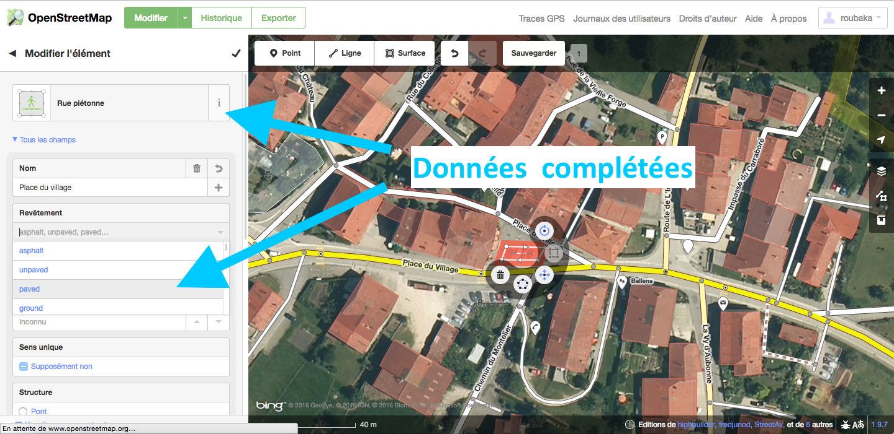
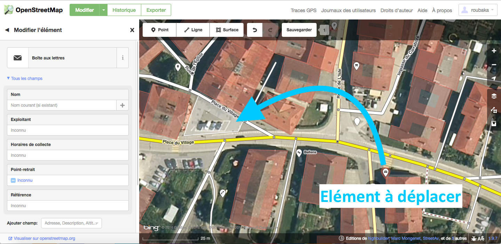
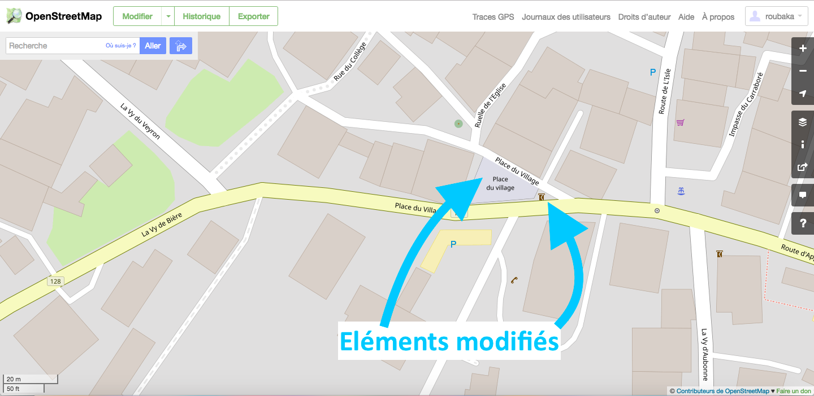
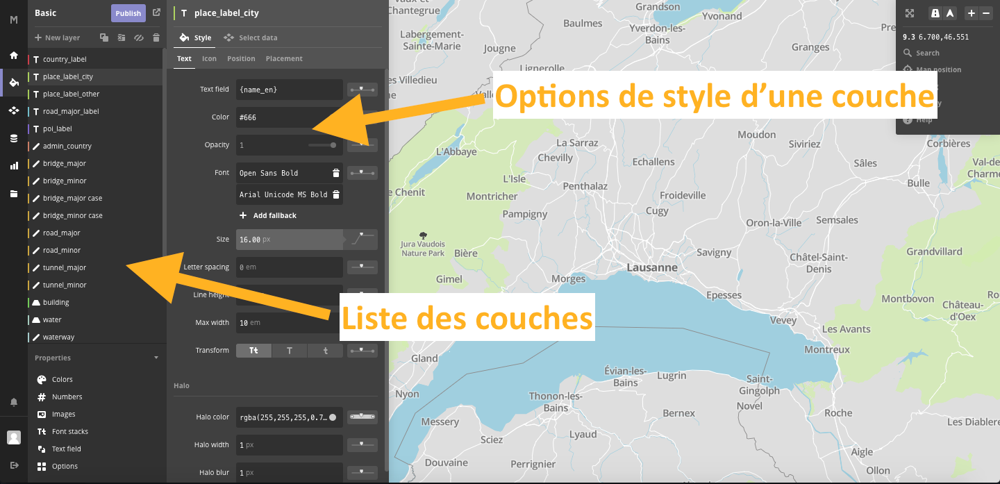
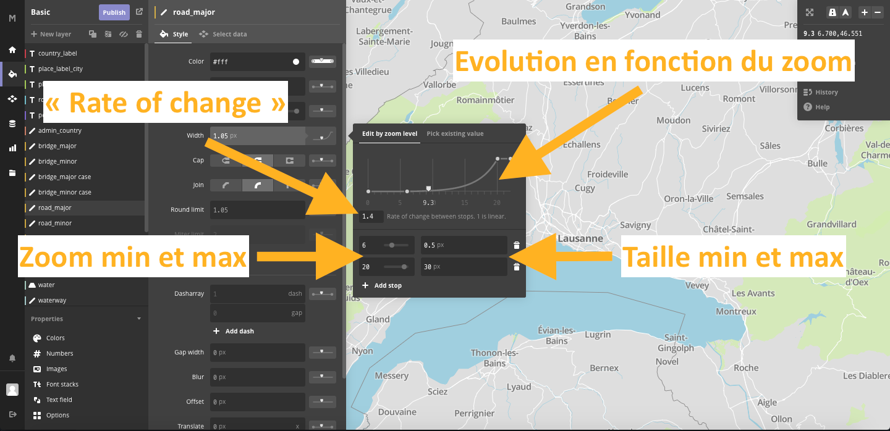
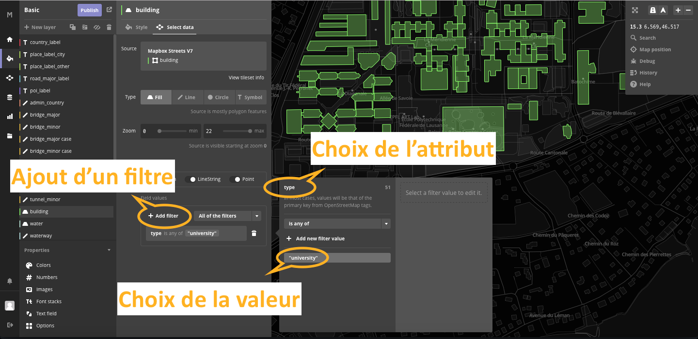
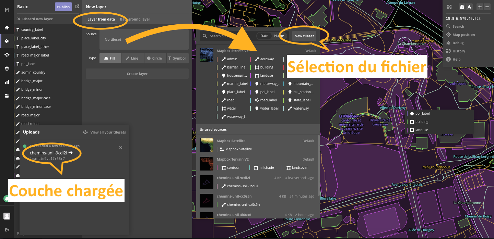
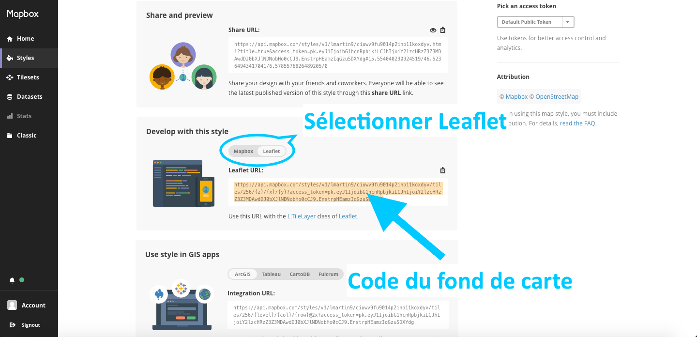

##### Atelier de géovisualisation 9

# Edition de fond de carte

Dans les ateliers précédents, nous avons vu comment intégrer un fond de carte déjà existant sur notre carte interactive à l'aide de **Leaflet**. La présence d'un sélecteur de couche permet par ailleurs de choisir parmi ces fonds de carte (*p.ex* *OpenStreetMap* VS *Images Satellites ESRI*) en fonction des besoins des utilisateurs et des données ajoutées à la carte. Dans certaines situations, ces fonds de carte peuvent poser certains problèmes s'ils sont erronés ou s'ils ne permettent pas une communication visuelle adéquate. Cet atelier explore des solutions relatives à ces problèmes par le biais de :

- L'édition de couches **OpenStreetMap**
- La création d'un fond de carte personnalisé à l'aide de **Mapbox**

## 1. Edition de couches OpenStreetMap

### 1.1 Introduction

**OpenStreetMap** est un projet de cartographie collaborative permettant la création de cartes et fonds de cartes libres de droits d'utilisation. A l'image des logiciels de type *open source*, tous les utilisateurs peuvent utiliser librement ces cartes et contribuer à leur édition au cours du temps. Pour ce faire, les utilisateurs s'appuyent sur un fond de carte satellite ou sur des données GPS prises directement sur le terrain pour les régions non couvertes par satellite.

>(source : <https://en.wikipedia.org/wiki/OpenStreetMap>)

Le but est ici d'apporter votre contribution au fond de carte *OSM* en éditant par vous-mêmes une région que vous connaissez bien et sur laquelle il est susceptible d'y avoir des erreurs. Votre connaissance du terrain permettra d'améliorer les fonds de carte pour les prochains utilisateurs. Pour commencer, rendez-vous sur <https://www.openstreetmap.org/>. Vous devriez reconnaître le fond de carte que vous avez utilisé dans les ateliers précédents. Afin de pouvoir éditer le fond de carte, vous devrez tout d'abord crérer votre compte sur *OpenStreetMap* (en haut à droite, **s'inscrire**). Une fois votre compte créé, vous pourrez vous lancer dans l'édition du fond de carte en cliquant sur **modifier** en haut à gauche de votre fenêtre. Lors de votre première connection le site vous propose alors deux options: vous pouvez visionner le bref tutoriel pour avoir une première introduction aux fonctionnalités de *OpenStreetMap*.

### 1.2 Edition du fond de carte

Lorsque vous passez en *mode édition* vous remarquez que le fond de carte dispartaît au profit du fond de carte satellite: c'est sur ce dernier que vous baserez vos modifications, comme illustré dans l'exemple suivant.

*Remarques*

- Par souci de précision, il faut être à un niveau de zoom élevé pour pouvoir éditer la carte. 
- Les modifications illustrées dans l'exemple suivant ont déjà été effectuées. C'est à vous de de trouver une zone sur laquelle subsistent des erreurs. Les zones urbaines étant généralement bien à jour, cherchez plutôt dans des lieux reculés (*p.ex* à proximité de votre chalet d'alpage égaré au fond d'une vallée ou dans le nouveau quartier villa de votre hameau).

##### 1.2.1 Exemple d'erreurs

La *Figure 1.1* illustre une erreur sur la place d'un petit village du pied du Jura: lorsque l'on passe le curseur dessus, le fond *OSM* y indique la présence d'un parking. Cependant, la place a récemment bénéficié d'un remaniement urbanistique de pointe par l'implentation de bancs publics en lieu et place de l'ancien parking. De plus, la boîte aux lettres communale a également été déplacée sur cette même place.


*Figure 1.1 : Illustration d'une zone nécessitant une mise à jour*

Il s'agit donc de mettre à jour les données de cette zone selon les 3 aspects suivants:

- Les attributs
- La géométrie
- La localisation

##### 1.2.2 Attributs

Pour mettre à jour cette donnée, il faut **sélectionner** le polygone délimitant ce parking à l'aide d'un simple clic. Il est désormais possible de modifier les données relatives à ce polygone en cliquant sur **modifier l'élément**. Vous verrez un menu s'ouvrir avec une barre de recherche ainsi qu'une liste de différentes catégories de polygones (*Eléments d'occupation du sol, éléments pour bâtiments etc.*). Pour en savoir davantage sur les données référencées par *OSM* référez-vous à la page suivante : <https://wiki.openstreetmap.org/wiki/Map_Features>

Dans ce cas précis, l'élément *rue piétonne* est celui qui semble le plus approprié. Le bouton d'information **i** situé sur la droite donne des informations sur le type de polygone. La *Figure 1.2* illustre des métadonnées qu'il est possible de compléter selon nos connaissances du terrain. (*p.ex* on sait qu'il s'agit dans ce cas de la place du village, qu'elle est désormais pavée et qu'elle dispose d'un éclairage). Notez que toute modification peut être annulée à l'aide d'un clic sur la **flèche de retour** située dans la barre d'outils au dessus de la carte, ou à l'aide du raccourci clavier `CTRL + Z` ou `cmd + Z` selon votre système d'exploitation.


*Figure 1.2 : Modification des attributs relatifs au polygone*


##### 1.2.3 Géométrie

L'emprise au sol du parking étant différente de la place, il s'agit de modifier la géométrie du polygone lui-même: 

- Pour déplacer un sommet, il faut cliquer dessus et le déplacer à l'endroit voulu
- Pour ajouter un sommet, il faut cliquer sur la flèche située au milieu d'une arrête, puis le positionner à l'endroit voulu
- Pour supprimer un sommet, il faut cliquer dessus, puis cliquer sur la petite poubelle (*supprimer définitivement l'objet*)

Une fois le polygone modifié, il faut cliquer sur **sauvegarder** dans la barre d'outils au-dessus de la carte. Ajoutez un commentaire pour documenter votre édition et c'est terminé. *OSM* gère évidemment les trois types de primitives vectorielles (*point*, *ligne* et *polygone*). Il est donc possible d'ajouter, supprimer ou modifier les tracés de route ou des points particuliers ainsi que leurs attributs.


##### 1.2.4 Localisation

Il est également possible de simplement déplacer des éléments: La boîte aux lettres communale étant désormais sur la nouvelle place du village, il faut la déplacer comme illustré sur la *Figure 1.3*. Pour cela, il suffit de sélectionner l'élément et de le déplacer à l'endroit voulu.


*Figure 1.3 : Point à déplacer sur la carte*

A nouveau, il faut sauvegarder la modification et la commenter. Les modifications sont désormais visibles sur les cartes *OSM*, comme le montre la *Figure 1.4* sur la place du village nouvellement ajoutée. On observe que la boîte aux lettres se situe sur la *place du village*, nommée ainsi à la suite de la modification.


*Figure 1.4 : Illustration du fond OSM désormais mis à jour*

##### 1.2.5 Nouveaux éléments

Notons encore que ces manipulations permettent de modifier des éléments déjà existants sur le fond de carte. Vous pouvez naturellement dessiner de nouveaux éléments de tous types en cliquant sur les boutons *point*, *ligne* et *polygone* dans la barre d'outil située au dessus de la carte lorsque vous êtes en mode édition.

- Pour créer un nouveau *point*, il suffit de cliquer sur l'endroit de la carte où vous souhaitez qu'il apparaise
- Pour créer une nouvelle *ligne*, vous pouvez délimiter son tracé par segments. Déterminez la fin de la ligne en cliquant à nouveau sur le le dernier point que vous avez créé ou en cliquant sur un point déjà existant (*p.ex* s'il s'agit d'une nouvelle route qui rejoint une route déjà existante)
- Pour créer un nouveau *polygone*, vous devez délimiter son périmètre arrête par arrête. Pour clôturer le polygone, il suffit de cliquer une nouvelle fois sur le dernier point que vous avez dessiné

Une fois ces éléments créés, vous pouvez les modifier comme décrit précédemment.


## 2. Création d'un fond de carte personnalisé

### 2.1 Introduction

Dans certains cas de géovisualisation, il se peut qu'aucun fond de carte ne convienne aux besoin des développeurs ou des utilisateurs, indépendamment de leur justesse. Pour remédier à cela, il est possible de créer des fonds de carte entièrement personnalisés en utilisant des couches vectorielles choisies, à l'instar du procédé dans un logiciel SIG classique. Nous allons ici utiliser **Mapbox Studio**, une plateforme de gestion de données spatiales et de création de fonds de carte personnalisés. Vous trouverez un résumé des fonctionnalités qu'offre cette plateforme à l'adresse suivante: <https://www.mapbox.com/help/getting-started-mapbox-studio-1/>. Nous allons ici nous intéresser à 3 d'entre elles notamment pour:

- Gérer et personnaliser l'apparence de couches pour adapter notre fond de carte sur la base d'un modèle
- Ajouter une couche vecteur personnelle sur notre fond de carte
- Ajouter le fond de carte nouvellement créé sur notre carte interactive à l'aide de **Leaflet**

*Remarque*

- Le but est ici d'explorer les possibilités qu'offre un outil tel que **Mapbox Studio**. Vous aurez loisir de vous consacrer à la création d'un fond de carte précis dans le cadre de votre projet personnel une fois que vous en aurez déterminé la thématique et les besoins en terme de communication visuelle.

Pour commencer, rendez-vous sur <https://www.mapbox.com/studio/>. Créez-vous un compte en cliquant sur **Sign up** en haut à droite. Une fois que vous avez un compte, vous pouvez commencer à créer un nouveau fond de carte. Dans la barre de navigation à gauche de l'écran, allez sur **Styles**. Cette page répertorie tous vos fonds de cartes personnalisés. Vous allez créer votre premier en cliquant sur **New style**. **Mapbox Studio** vous propose alors un certain nombre de modèles de base: commencez par choisir **basic** puis **create**. Vous aurez tout le loisir de personnaliser vos fonds de cartes routière et de cartes satellites par la suite. Si tout s'est bien passé, vous devriez vous retrouver dans la fenête du *Style Editor* avec un écran affichant un fond de carte basique. Vous pouvez alors naviguer sur cette carte pour voir à quoi ressemble le modèle, puis commencer à l'éditer.

### 2.2 Edition des couches

Cette partie passe en revue les fonctions basiques que vous devez connaître pour travailler un fond de carte sur **Mapbox Studio**. Vous trouverez un complément d'information sur le lien suivant: <https://www.mapbox.com/help/getting-started-mapbox-studio-2/>

##### 2.2.1 Gestion des couches

L'*éditeur de style* de **Mapbox Studio** constitue une série de règles relative à la manière dont doivent être dessinées et symbolisées les couches comprises dans le fond de carte. La fenêtre de l'éditeur est composée de deux élélments majeurs: la carte, au centre, et la barre de gauche, qui représente les couches affichées sur cette carte, ainsi que les options de style d'une couche particulière lorsqu'elle est sélectionnée (*voir Figure 2.1*).


*Figure 2.1: Fenêtre de base du style editor de* ***Mapbox Studio***

A l'instar d'un logiciel *SIG* classique, il est possible d'effectuer des manipulations de base sur ces couches au sein de la barre latérale:

- De manière intuitive, les couches du haut s'affichent par dessus les autres et inversement. Vous pouvez changer l'ordre de ces dernières en cliquant dessus puis en les faisant glisser de haut en bas. Par défaut, les couches du dessus représentent les labels de votre carte, puis viennent les lignes (principalement des routes) et enfin les polygones tels que les parcs, les lacs mais également les bâtiments
- Vous pouvez cacher une couche en la séléctionnant d'un simple clic puis en cliquant sur *hide 1 layer* (symbole d'un oeil barré) en haut de la barre latérale. Elle apparaît alors en gris foncé dans la barre. De même, vous pouvez la supprimer en cliquant sur *delete 1 layer* (symbole d'une poubelle). Il est également possible de les regrouper (comme pour une série de calques dans un logiciel de graphisme) et de les dupliquer
- Dans la fenêtre de style des couches, vous pouvez changer des paramètres de symbologie telle que la couleur d'une couche, son opacité, le label à afficher en fonction des attributs, l'épaisseur des traits *etc.* Notez que les options disponibles varient en fonction du type de couche sélectionné

Vous pouvez commencer par éditer quelques uns de ces paramètres pour prendre en main **Mapbox Studio** et voir comment ils affectent votre fond de carte. Ne paniquez pas en cas de fausse manoeuvre : comme dans tout logiciel, il est possible de revenir en arrière à l'aide du raccourci clavier `CTRL + Z` ou `cmd + Z` selon votre système d'exploitation.

##### 2.2.2 Adaptation en fonction du zoom

Lors de votre navigation au sein de cette carte, vous avez probablement remarqué que le contenu de la carte varie en fonction du niveau de zoom, un aspect fondamental du tri et de la simplification de l'information en fonction de l'échelle géographique. Vous connaissez ce principe depuis longtemps si vous êtes des utilisateurs de *Google Maps*, par exemple. L'avantage de **Mapbox Studio** est de pouvoir personnaliser les apparences des différentes couches pour différents niveaux de zoom selon nos envies. La *Figure 2.1* illustre la gestion de l'épaisseur des routes principales en fonction du zoom (couche *road_major*, paramètre *width*).


*Figure 2.2: Fenête de l'édition des couches en fonction des niveaux de zoom*

- Les valeurs de **Zoom min et max** (ici respectivement *6* et *20*) indiquent l'intervalle dans lequel la couche varie. En dessous du *zoom minimum* la couche n'est pas visible et une fois le **zoom maximum** atteint la couche n'évolue plus (Les niveaux de zoom variant entre 0 et 22)
- Les valeurs de **Tailles min et max** (ici respectivement *0.5px* et *30px*) indiquent l'épaisseur minimale (au niveau de de *zoom minimal*) et son épaisseur maximale, au niveau de *zoom maximal*
- La valeur **Rate of change** indique à quelle vitesse évolue la taille entre les deux points définis. La valeur de ce paramètre est comprise entre **0.01** et **1.99**. Une valeur de **1** indique une progression parfaitement linéaire. Des *valeurs inférieures à 1* permettent une progression logarithmique (forte croissance puis constance sur les niveaux de zoom élevés) et des *valeurs supérieures à 1* une progression exponentielle (constance au début puis forte croissance aux niveaux de zoom élevés)
- Il est également possible d'ajouter des paliers intermédiaires fixes en cliquant sur **add stop**

**Mapbox studio** permet de paramétrer de nombreux réglages de symbologie en fonction du zoom, parmis lesquels: l'épaisseur des lignes, l'épaisseur des contours des polygones, l'opacité d'une couche ou sa couleur, la taille des labels, le type de police utilisé, l'espacement entre les caractères *etc.*

##### 2.2.3 Filtres

Il se peut que certaines couches contiennent trop d'informations par rapport à nos besoins: il est alors utile de pouvoir trier l'information en fonction de certains attributs pour ne garder que les éléments qui nous intéressent. Supposons que nous voulons afficher uniquement les bâtiments de l'université pour faciliter la lecture et focaliser sur le campus.

Pour ce faire, zoomez sur le campus et sélectionnez la couche des bâtiments (*building*). Allez dans l'onglet **select data**: votre couche est alors mise en avant par rapport au reste de la carte. Pour effectuer le tri, cliquez sur **Add filter** au bas de la fenêtre puis sélectionnez l'attribut **type** et la valeur **university**. La *Figure 2.3* illustre cette démarche et le résultat qui devrait apparaître à l'écran. On remarque que les bâtiments situés au bord du lac sont devenus invisibles et que seul ceux de l'EPFL subsistent. Vérifiez que l'opérateur de choix indique bien *Is any of*.


*Figure 2.3: Ajout d'un tri pour n'afficher que les bâtiments de type universitaires sur la couche des bâtiments*

Notons qu'il est possible d'ajouter plusieurs valeurs d'attributs en cliquant sur **Add new filter value**. L'opérateur peut également être choisi de 4 manières différentes:

- *exists* ou *does not exist* conserve les entités pour lesquelles l'attribut existe ou non
- *is any of* ne conserve que les unités pour lesquelles l'attribut sélectionné correspond à la valeur sélectionnée
- *is not any of* ne conserve que les unités pour lesquelles l'attribut sélectionné est différent de la valeur sélectionnée

### 2.3 Ajouter une couche vecteur

Bien que **Mapbox Studio** dispose de nombreuses couches de base, il peut être nécessaire d'ajouter des couches personnalisées dans des cas particuliers (*p.ex* données reccueillies sur un terrain, couche inexistante sur les données de base). A titre d'exemple, nous allons ajouter la couche des chemins de l'UNIL utilisée dans l'atelier précédent.

Pour commencer, il faut cliquer sur **New layer** en haut de la barre latérale puis **No tileset** dans l'onglet *Source*. Cliquez ensuite sur **New tileset** dans les menus qui apparaissent ensuite. Dans la fenêtre qui s'ouvre, cliquez sur **Select a file** et allez chercher sur votre ordinateur le fichier **chemins.unil.geojson** après l'avoir téléchargé sur *Moodle* puis cliquez sur **Upload**. Notons qu'il est également possible d'uploader des fichiers *shapefile* sous forme de *dossier compressé*. Une fois le chargement de la couche terminé, cliquez dessus. Dans la nouvelle fenêtre, vous devriez reconnaître les chemins dans l'aperçu. Cliquez sur **Add to style** et sélectionnez votre style précédemment édité (*Basic* si vous ne l'avez pas renommé). La *Figure 2.4* résume ces manoeuvres.


*Figure 2.4: Fenêtres liées à l'ajout d'une couche vecteur sur le fond de carte*

Vous voyez s'afficher votre nouvelle couche sur votre carte. Cliquez sur **create layer** pour valider votre choix. La couche apparaît maintenant au dessus des autres dans la liste et il est désormais l'éditer comme l'ensemble des autres couches de **Mapbox Studio** (*p.ex* en ajustant la taille des chemins en fonction du zoom).

### 2.4 Ajouter votre fond de carte à une carte interactive

##### 2.4.1 Sauvegarde du fond de carte

Une fois l'édition de notre fond de carte terminée, nous allons la sauvegarder pour l'incorporer à notre carte interactive. Il faut commencer par cliquer sur **Publish** en haut de la barre latérale puis à nouveau sur **Publish** dans la fenêtre suivante (qui permet de comparer la couche avant l'édition et après). A ce moment, choisissez **Preview, develop and use**. Une nouvelle page s'ouvre: pour choisir d'afficher la carte avec **Leaflet**, cherchez le second menu **Develop with this style** puis sélectionnez **Leaflet**. La partie surlignée en jaune sur la *Figure 2.5* correspond au lien qu'il vous faudra copier dans votre code *javascript* pour afficher votre fond de carte nouvellement créé.


*Figure 2.5: Fenêtres liées à l'ajout d'une couche vecteur sur le fond de carte*

Cliquez sur le bouton situé en haut à droite du lien en question pour le copier dans le presse-papier, puis retournez sur votre éditeur de texte et ouvrez votre *script.js* du dernier atelier.

##### 2.4.2 Incorporation du fond de carte à notre carte interactive

Il ne vous reste plus qu'à coller le lien dans votre code. Ajoutez-le à l'endroit où vous avez déclaré les autres variables contenants les fonds de carte. Cela devrait ressemblrer à quelque chose comme cela, en version raccourcie:

```javascript
var osmLayer = L.tileLayer('http://{s}.tile.osm.org/{z}/{x}/{y}.png', {
  attribution: '&copy; <a href="http://openstreetmap.org">OpenStreetMap</a> contributors'
});
var osmNoirBlanc = L.tileLayer(...
```
Pour ajouter votre fond de carte, crééez une nouvelle variable et insérez le lien à l'intérieur de la fonction `L.tileLayer()` en faisant **Edition > Coller** (**Edit > Paste** en anglais) ou à l'aide du raccourci clavier `CTRL + V` ou `cmd + V` selon votre système d'exploitation.

```javascript
var myMapbox = L.tileLayer('-- >> VOTRE LIEN VA ICI << --', {
  attribution: '&copy; <a href="http://openstreetmap.org">OpenStreetMap</a> contributors'
});  
```
Notez bien que votre fond de carte comporte votre nom d'utilisateur. Vous aurez donc tous un lien différent. Pour le faire apparaître sur votre carte, vous devez l'ajouter à votre liste de fond de carte, soit le bloc de code commençant par `var baseLayers = {...`

Ajoutez une ligne en donnant un nom à votre couche (*p.ex* **Mon fond Mapbox**) et faites le lien avec votre variable **myMapbox** comme suit:

```javascript
var baseLayers = {
  "OpenStreetMap": osmLayer,
  "OpenStreetMap noir/blanc": osmNoirBlanc,
  "Mapbox Streets": mapboxStreets,
  "Photos aériennes ESRI": esriImagery,
  "Mon fond Mapbox": myMapbox
};
```
N'oubliez pas d'enregistrer vos modifications dans l'éditeur de texte, puis ouvrez votre fichier **index.html** avec votre navigateur. Si tout s'est bien passé, votre sélecteur de couche doit comporter une option **Mon fond Mapbox** qui permet d'afficher le fond de carte que vous venez de créer!