# Concepts de base en géovisualisation

## Semaine 1: Introduction à la géovisulisation

__Christian Kaiser__  
Institut de géographie et durabilité  
Université de Lausanne

---

## Plan

- Présentation du cours

    - Site Web du cours

    - Objectifs et programme du cours

    - Déroulement des ateliers et du travail personnel

- Introduction à la géovisualisation

    - Pourquoi visualiser?

    - Visualiser pour mieux analyser

---

## Encadrement

- Enseignant:
	- Christian Kaiser, MER  
		IGD, GEO-3610

- Assistants:
	- Lucien Grangier
    - Lucas Martinez
    - Ludivine Stofer
   
---

## Présentation du cours

- __Site Web__

	- https://github.com/christiankaiser/geovis1
    - Toutes les informations relatives au cours se trouvent sur le site Web!

- __Annonces et questions__

	- Sur Slack: https://geovis1.slack.com
	- Voir syllabus pour lien d'inscription
    - Toutes les annonces sont faites dans le canal `#annonces` sur Slack
    - Posez vos questions dans le canal `#general`

---

## Présentation du cours

- Syllabus et programme: https://github.com/christiankaiser/geovis1

---

## Objectifs d’apprentissage

- Théorie:

    - Introduire la théorie et les méthodes récentes en visualisation d’information géographique
    - Connaître les différentes variantes de visualisation d’information
    - Aperçu des principes de création d’outils de géovisualisation
    - Connaître les possibilités, limites et questions de recherche actuelles de la géovisualisation

---

## Objectifs d’apprentissage

- Pratique:

    - Mettre en oeuvre des outils simples de cartographie interactive sur le Web

    - Expérimenter avec des technologies modernes pour visualiser nos résultats de recherche

    - Savoir appliquer les principes théoriques de la géovisualisation

---

## Evaluation

Par un projet de cartographie interactive

- Projet avec Leaflet
- Projet individuel
- Démarrage formel du projet: semaine 9
- Date de rendu: semaine 14 (dernier jour du semestre)

---

## Géovisualisation dans votre cursus

- __Semestre 1__: Concepts de base de géovisualisation

    - Bases théoriques cartographie interactive
    - Création d'une simple story map (sur Wevis)
    - Création de cartes interactives simples avec Leaflet (en Javascript)
    - Adaptation de fonds de cartes personnels avec MapBox Studio

---

## Géovisualisation dans votre cursus

- __Semestre 2+3__: Géovisualisation dynamique et traitement de données

    - Théorie avancée et recherches actuelles en géovisualisation
    - Création d’applications mobiles de cartographie interactive
    - Cartographie dynamique (avec base de données)
    - Traitement et analyse de données
    - 1er semestre: théorie avec ateliers pratiques
    - 2ème semestre: projet de géovisualisation

---

### Posez des questions!

- Posez des questions...

	- durant le cours
    - pendant la pause
    - pendant les ateliers
    - sur Slack

- Nous sommes assez grands pour faire une discussion intelligente...

- __Important : gardez la bonne humeur!__

---

# Introduction à la géovisualisation

---

## Pourquoi visualiser?

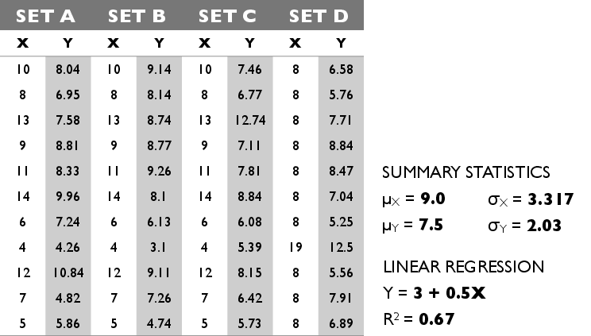

---

## Pourquoi visualiser?

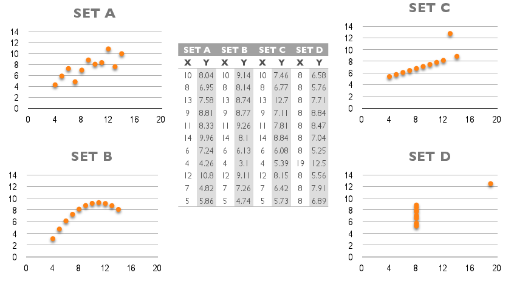

---

## Visualisation: c’est quoi?

- Visualiser:

    - *Petit Robert:* Rendre visible (un phénomène qui ne l’est pas)

        - Visualiser l’écoulement de l’air dans une soufflerie.
        - Visualiser par un graphique des chiffres de production.
        - Visualiser un organe, un phénomène physiologique

---

## Visualisation: c’est quoi?

- Visualiser:

    - *Oxford English Dictionary:* To form a mental vision, image, or picture of (something not visible or present to the sight, or of an abstraction); to make visible to the mind or imagination.

    - *Oxford English Dictionary:* To form a mental picture of something not visible or present, or of an abstract thing, etc.; to construct a visual image or images in the mind.

---

## Visualisation: c’est quoi?

- Concepts liés à la visualisation:

    - Créer une __image mentale__ chez l’autre
    - Représenter quelque chose qui __n'est pas visible__
    - __Communiquer__ une information / des données

- Communication implique:

    - __Coder__ une information (représentation visuelle / textuelle)
    - __Transmettre__ une information (p.ex. par fichier informatique)
    - __Décoder__ une information (reconnaissance d’une image, compréhension d’un texte, perception & cognition)

---

## Pourquoi visualiser?

- __Communiquer__ une information
- __Rendre accessible__ une information (public cible?)
- __Faciliter la compréhension__ d’un phénomène (mise en contexte p.ex.)
- Donc: __faciliter la réflexion__ sur un phénomène
- Et finalement: aider à la __prise de décisions__
- Ou simplement __pour motiver, démontrer une idée, etc.__

---

## Représentation de données...

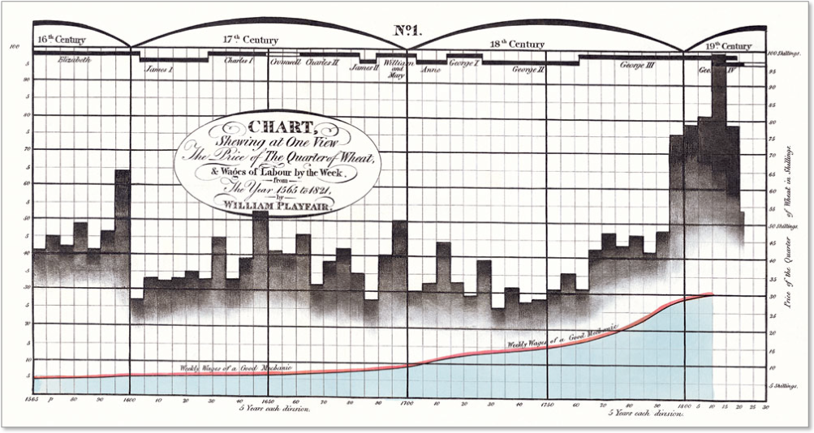  

William Playfair (1759–1823). <http://www.economist.com/node/10278643>

---

## Représentation de données...

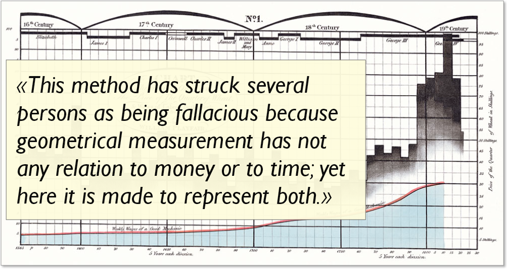

William Playfair (1759–1823). <http://www.economist.com/node/10278643>

---

## Représentation de données...

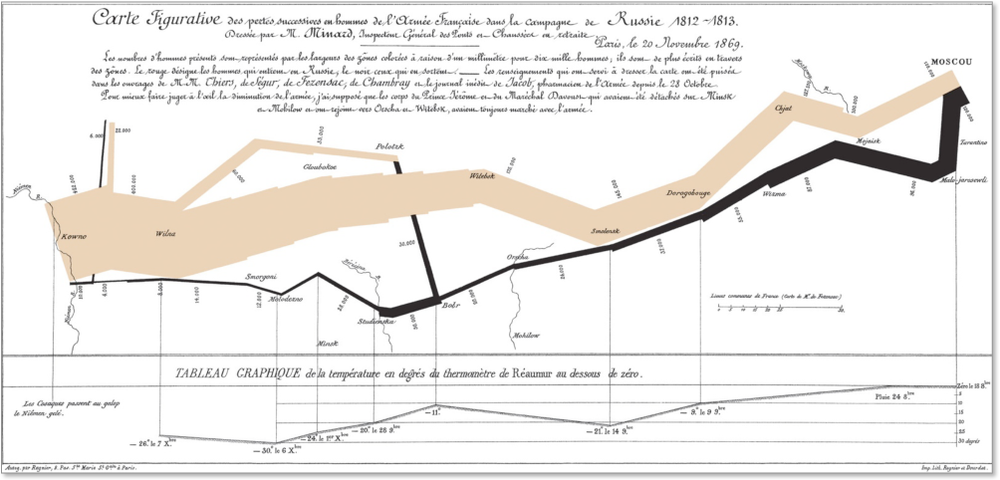

Charles Joseph Minard (1781–1870).
<http://www.economist.com/node/10278643>

---

## Représentation de données...

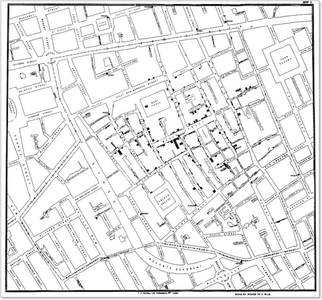

John Snow (1813–1858). Cholera cluster map (1854).
<http://en.wikipedia.org/wiki/John_Snow_(physician)>

---

## Analyse exploratoire de données

- Début par John W. Tukey (1915–2000)
- Statisticien de renommée mondiale (p.ex. FFT)
- PRIM-9: Logiciel de visualisation interactive et dynamique pour l’exploration de données multi-variées, un peu similaire à GGobi. Année: 1972!

	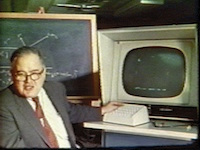

	Regardez la vidéo de présentation de PRIM-9:
<http://stat-graphics.org/movies/prim9.html>

---

## Visualisation scientifique

- Visualisation de phénomènes 3D ou d’avantage de manière pseudo-réaliste
- P. ex. visualisation de modèles scientifiques (résultats de calcul scientifique)
- Visualisation de données de télédétection, ou synthèse de données de multiples sources

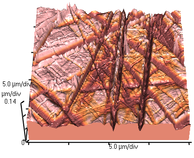 &nbsp;&nbsp;&nbsp; 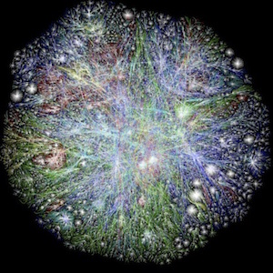

---

## Domaines de géovisualisation

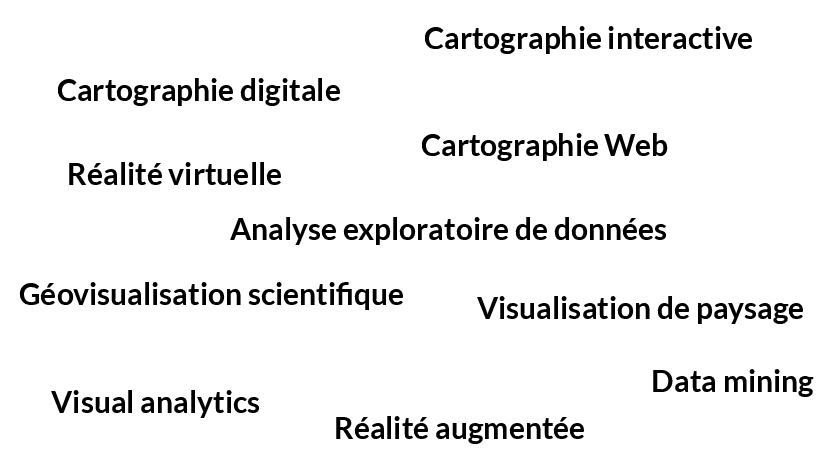

---

## Cartographie interactive

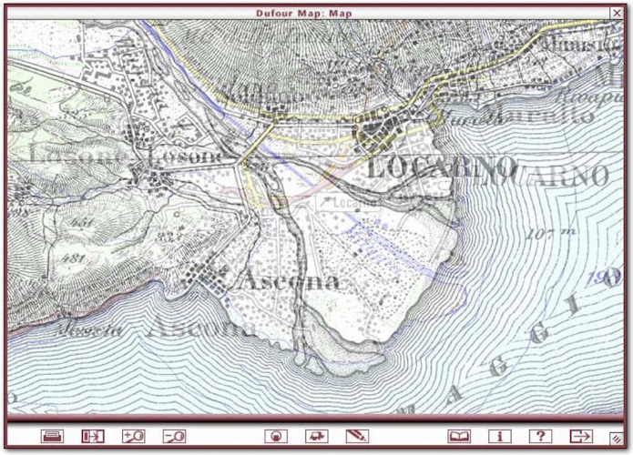

Dufour Map - interactif (Swisstopo)

---

## Cartographie interactive

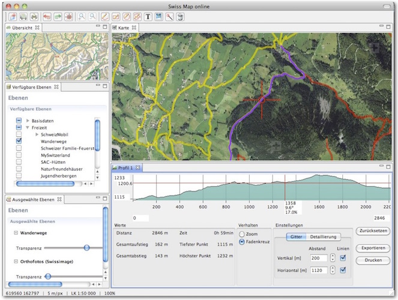

Swiss Map online

---

## Cartographie Web (web-mapping)

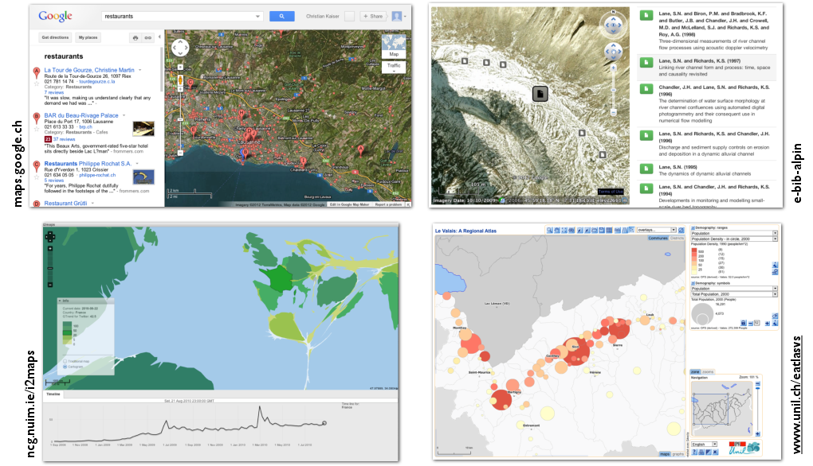

---

## Data mining

- Combinaison d’informatique et statistique
- Découverte de structures dans des grandes bases de données
- Méthodes de statistique, intelligence artificielle, apprentissage machine etc.
- Visualisation des résultats, et mise à jour dynamique de la visualisation après modification des requêtes

	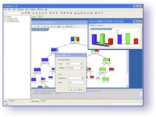

---

## Visual analytics

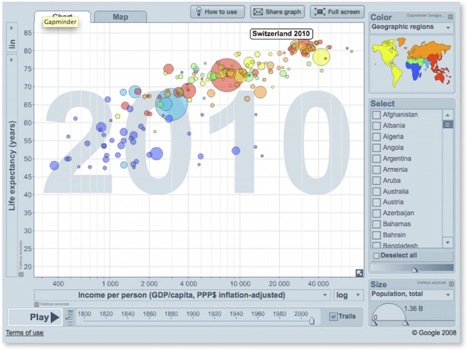

[www.gapminder.org](www.gapminder.org)

---

## Geovisual analytics

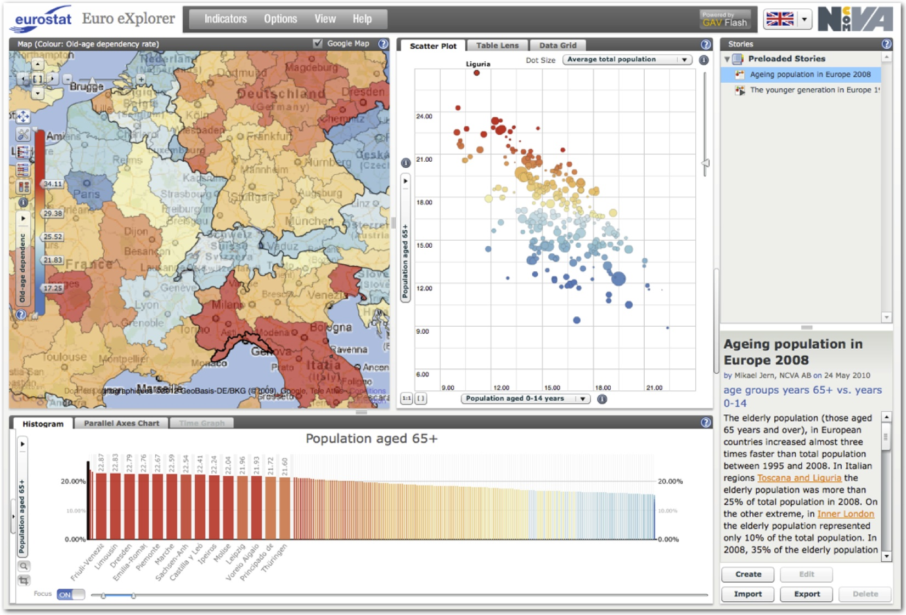
eXplorer: [ncva.itn.liu.se/explorer](ncva.itn.liu.se/explorer)

---

## Réalité virtuelle

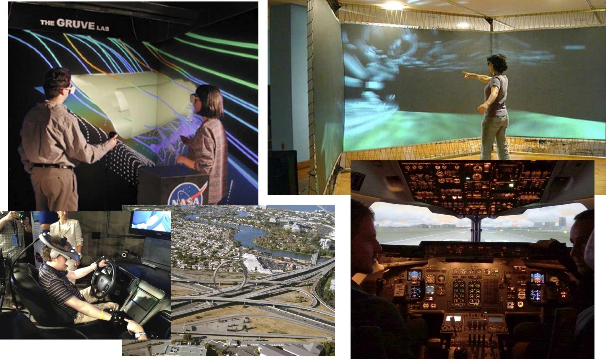

---

## Réalité augmentée

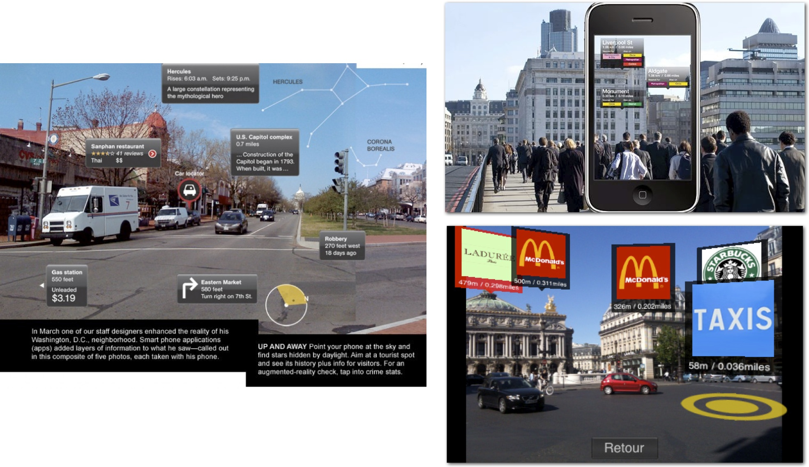

---

## Géovisualisation mobile

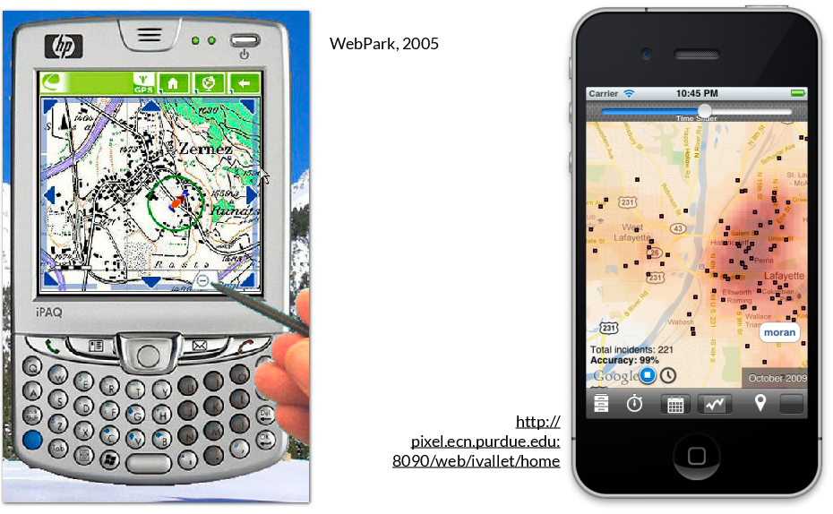

---

## Géovisualisation mobile

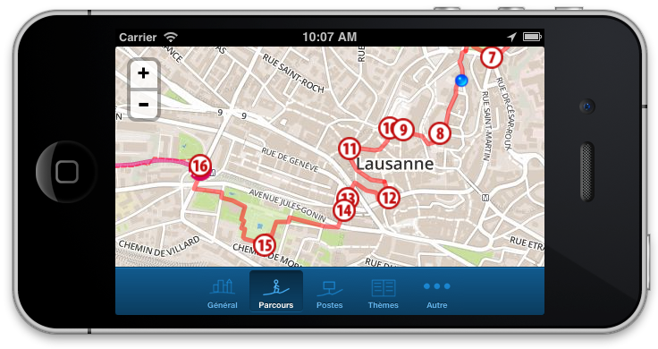

GéoGuide Lausanne: <http://igd.unil.ch/geoguide>

---

## Géovisualisation collaborative

- Collaboration synchrone, au même endroit

	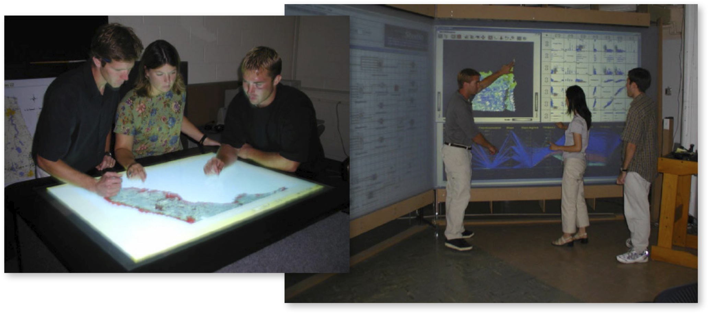

	http://geoanalytics.net

---

## Géovisualisation collaborative

- Collaboration asynchrone et délocalisée

	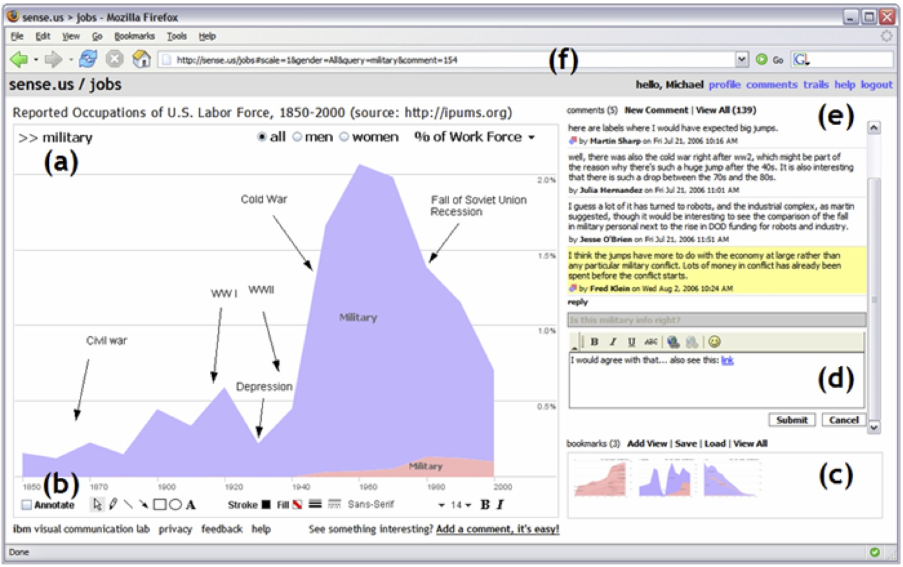  
	http://sense.us
    
---

## Suite...

- Atelier 1: créer une storymap (en salle informatique)

