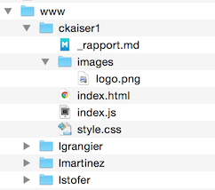

Concepts de base en géovisualisation

# Projet individuel

## 1. Objectif

Le but du projet individuel est de créer une application simple de cartographie interactive permettant soit de communiquer sur un sujet de votre choix, soit d'explorer un jeu de données en vue dans le cadre d'un problème d'aide à la décision. Vous devez également créer une documentation comprenant une justification de vos choix.

L'application sera écrite en HTML et Javascript, en utilisant la librairie Leaflet.

Il est essentiel de réfléchir au but de votre application, au public cible, à la façon optimale de présenter vos informations, et de documenter ces choix, notamment en faisant des liens avec le matériel enseigné pendant le semestre.

Vous avez beaucoup de flexibilité sur le sujet et la mise en forme. Les seuls points à respecter sont les suivants:

- Votre application doit avoir un ou plusieurs fonds de carte adapté(s) à votre projet de communication ou d'exploration de données (la création de fonds de cartes personnalisés est expliqué pendant la semaine 9)
- Votre application doit contenir une couche vectorielle tel que des polygones ou lignes, et potentiellement des marqueurs.
- Votre application doit contenir une interactivité au niveau des informations à présenter.
- N'oubliez pas d'ajouter tous les éléments importants en vue d'une communication efficace.

## 2. Données de base

Vous êtes libres à vous procurer des données libres ou même d'en inventer. Vous avez bien évidemment la possibilité d'utiliser l'ensemble des données SIG de l'UNIL. Pour plus d'informations concernant ces données, visitez le site [http://unil.ch/gis](http://unil.ch/gis). Un formulaire de demande d'accès au serveur des données SIG s'y trouve, ainsi qu'un catalogue de l'ensemble des données.

Dans tous les cas, vous allez devoir transformer vos données en coordonnées WGS84 (p.ex. avec ArcGIS ou QGIS), et vos fichiers vectorielles en GeoJSON (p.ex. avec QGIS, ogr2ogr ou http://2geojson.com/).

## 3. Tests et feedback

Dans le cours de Géovis, nous avons appris comment développer un projet en faisant des petits pas itératifs, et de faire des tests d'utilisateurs fréquents et demander à chaque itération un feedback à des utilisateurs potentiels.

Appliquez cette méthode également à votre projet de Géovis. Définissez quelle est la première version _«aussi simple que possible»_ (selon la méthode KISS: Keep It Simple and Stupid). Et à chaque itération, définissez quel est le but suivant et comment vous évaluez cette nouvelle version. Documentez ce processus dans votre rapport.

## 4. Rapport

Votre projet doit être accompagné d'un petit rapport qui présente votre application. Expliquez notamment le but, le public cible, les réflexions au niveau de la visualisation, les points forts et faiblesses de votre application. Faites notamment des liens avec la matière enseigné dans le cours, notamment au niveau de la représentation cartographique, de l'interactivité, de la communication graphique et les aspects facilité d'utilisation, efficacité etc. Faites également référence à la littérature utilisée (voir p.ex. références dans le syllabus).

Le rapport contiendra également votre documentation sur le processus d'élaboration du projet (voir section 3 sur les tests et le feedback).

Insérez également quelques captures d'écran et expliquez le fonctionnement de l'application.

Indiquez également l'URL du projet (voir sous rendu comment obtenir une URL pour votre application HTML/Javascript.)

## 5. Rendu

Veuillez envoyer le rapport du projet en format PDF par e-mail à Christian.Kaiser@unil.ch. Le __délai de rendu__ est le __20.12.2017__. À partir du 22.01.2018, une pénalité de retard d'une demie note par jour est appliquée. 

Vous devez déposer votre application sur le serveur Web de Géovis, afin d'avoir une URL valable (l'URL doit commencer avec http://igd-bld05.unil.ch/). Pour déposer votre projet sur ce serveur, vous devez utiliser un logiciel SFTP, tel que Cyberduck ([cyberduck.io](https://cyberduck.io/), pour Mac et Windows), ou WinSCP (pour Windows). Ensuite connectez-vous au serveur en utilisant les paramètres suivants:

| URL:               | igd-bld05.unil.ch                 |
| -------------------|----------------------------------------- |
| Protocole:         | SFTP ou SSH                              |
| Port:              | 22 (si ce n'est pas 22, votre protocole est probablement faux) |
| Nom d'utilisateur: | _communiqué dans le cours_                                   |
| Mot de passe:      | _communiqué dans le cours_                              |

___Attention.___ La connexion fonctionne uniquement si:

- vous êtes physiquement à l'UNIL, ou
- vous êtes connecté au réseau de l'UNIL avec Pulse Secure (voir sur [crypto.unil.ch](https://crypto.unil.ch)), ou
- vous vous êtes authentifié au préalable sur [reseau.unil.ch](https://reseau.unil.ch).

Une fois connecté, vous y trouverez un dossier **www** que vous ouvrez. À l'intérieur de ce dossier, créez un dossier qui a comme nom votre nom d'utilisateur UNIL. C'est à l'intérieur de ce dossier que vous allez déposer l'ensemble de vos fichiers. Veillez à ce que votre fichier de départ s'appelle index.html et qu'il se trouve directement dans le dossier avec votre nom (et non pas dans un sous-dossier). La structure des dossiers sera donc quelque chose comme:

__Attention!__ Tous les dossiers dont le nom ne correspond pas à un nom d'utilisateur UNIL seront supprimés périodiquement par un script automatisé. Ainsi, soumettre un dossier avec un nom différent de votre nom d'utilisateur UNIL est équivalent à ne pas déposer votre projet!!!

En plus, assurez-vous de ne pas utiliser de caractères spéciaux, des espaces etc. dans l'ensemble des noms de fichiers et dossiers, mais uniquement des caractères minuscules, des chiffres, des tirets et des tirets-bas («underscore»).

Vous pourrez alors accéder à votre projet avec l'URL [http://igd-bld05.unil.ch/{{votre_nom_utilisateur}}](http://igd-bld05.unil.ch/{{votre_nom_utilisateur}}). Cette URL fonctionne uniquement à l'intérieur de l'UNIL (mêmes conditions que pour la connexion SFTP).

Gardez également une copie de votre projet sur votre ordinateur (qui est bien évidemment sauvegardé au moins une fois par jour).
